# Chaper 4 逻辑架构

## 1. 逻辑架构剖析

### 1.1 服务器处理客户端请求

那服务器进程对客户端进程发送的请求做了什么处理，才能产生最后的处理结果呢？这里以查询请求为例展示：

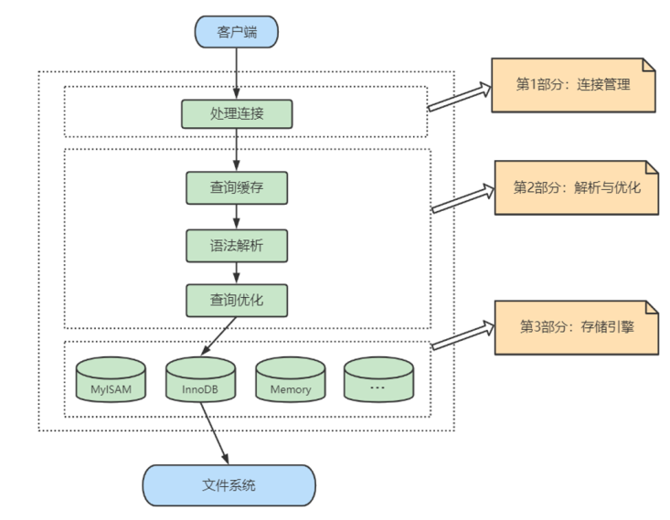

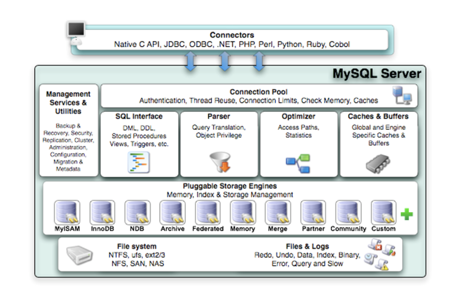

### 1.2 Connectors

### 1.3 第1层：连接层

系统（客户端）访问 `MySQL` 服务器前，做的第一件事就是建立 `TCP` 连接。
经过三次握手建立连接成功后，` MySQL` 服务器对 `TCP` 传输过来的账号密码做身份认证、权限获取。

- **用户名或密码不对，会收到一个Access denied for user错误，客户端程序结束执行**
- **用户名密码认证通过，会从权限表查出账号拥有的权限与连接关联，之后的权限判断逻辑，都将依赖于此时读到的权限**

思考问题

一个系统只会和MySQL服务器建立一个连接吗? 只能有一个系统和MySQL建立连接吗?

多个系统可以和MySQL服务器建立连接, 每个系统建立的连接肯定不止一个. 所以, 为了解决TCP无限创建和TCP频繁小会带来的资源耗尽,性能下降问题. MySQL服务器里有专门的TCP连接池限制连接数, 采用长连接模式复用TCP连接, 解决上述问题.


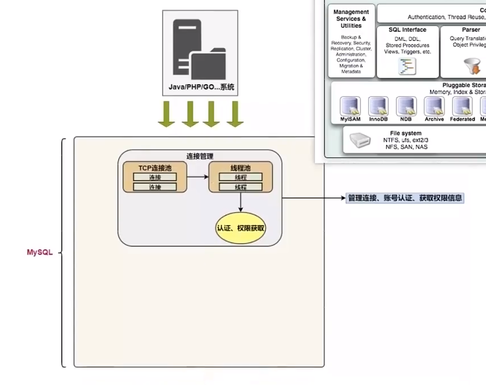

`TCP` 连接收到请求后，必须要分配给一个线程专门与这个客户端的交互。所以还会有个线程池，去走后面的流程。每一个连接从线程池中获取线程，省去了创建和销毁线程的开销。


这些内容我们都归纳到MySQL的连接管理组建中. 

所以连接管理的职责是负责认证, 管理连接, 获取权限信息. 


### 1.4 第2层：服务层

第二成架构主要完成大多数的核心服务功能, 如SQL接口, 并完成缓存的查询, SQL的分析和优化及部分内置函数的执行. 所有跨存储引擎的功能也在这一层实现, 如 过程, 函数等. 

在该层, 服务器会`解析查询`并创建相应的内部`解析树`, 并对其完成相应的优化: 如确定查询表的顺序, 是否利用索引等, 最后生成相应的执行操作. 

如果是SELECT语句,服务器还会`查询内部的缓存`. 如果缓存空间足够大, 这样在解决大量读操作的环境中能够很好的提升系统的性能. 

- **SQL Interface: SQL接口**

  - 接收用户的SQL命令，并且返回用户需要查询的结果。比如SELECT ... FROM就是调用SQL Interface
  - MySQL支持DML（数据操作语言）、DDL（数据定义语言）、存储过程、视图、触发器、自定义函数等多种SQL语言接口

- **Parser: 解析器**

  - 在解析器中对 SQL 语句进行语法分析、语义分析。将SQL语句分解成数据结构，并将这个结构传递到后续步骤，以后SQL语句的传递和处理就是基于这个结构的。如果在分解构成中遇到错误，那么就说明这个SQL语句是不合理的。
  - 在SQL命令传递到解析器的时候会被解析器验证和解析，并为其创建 语法树 ，并根据数据字典丰富查询语法树，会 `验证该客户端是否具有执行该查询的权限 `。创建好语法树后，MySQL还会对SQl查询进行语法上的优化，进行查询重写。

- Optimizer: 查询优化器

  - SQL语句在语法解析之后、查询之前会使用查询优化器确定 SQL 语句的执行路径，生成一个`执行计划 `。

  - 这个执行计划表明应该 使用哪些索引 进行查询（全表检索还是使用索引检索），表之间的连接顺序如何，最后会按照执行计划中的步骤调用存储引擎提供的方法来真正的执行查询，并将查询结果返回给用户。

  - 它使用“ `选取-投影-连接 `”策略进行查询。例如：

    ```sql
    SELECT id,name FROM student WHERE gender = '女';
    ```

    这个SELECT查询先根据WHERE语句进行`选取` ，而不是将表全部查询出来以后再进行gender过滤。 这个SELECT查询先根据id和name进行属性 `投影` ，而不是将属性全部取出以后再进行过滤，将这两个查询条件 连接 起来生成最终查询结果。

- Caches & Buffers： 查询缓存组件

  - MySQL内部维持着一些Cache和Buffer，比如Query Cache用来缓存一条SELECT语句的执行结果，如果能够在其中找到对应的查询结果，那么就不必再进行查询解析、优化和执行的整个过程了，直接将结果反馈给客户端。

  - 这个缓存机制是由一系列小缓存组成的。比如表缓存，记录缓存，key缓存，权限缓存等 。

  - 这个查询缓存可以在 不同客户端之间共享 。

  - 从MySQL 5.7.20开始，不推荐使用查询缓存，并在 `MySQL 8.0中删除` 。

    ```
    小故事：
    如果我问你9+8×16-3×2×17的值是多少，你可能会用计算器去算一下，最终结果35。如果再问你一遍9+8×16-
    3×2×17的值是多少，你还用再傻呵呵的再算一遍吗？我们刚刚已经算过了，直接说答案就好了。
    ```

### 1.5 第3层：引擎层

和其他数据库相比, MySQL有点与众不同, 他的架构可以在多种不同场景中应用并发挥良好作用, 主要体现在存储引擎的架构上. 插件式的存储引擎架构将查询处理和其他的系统任务以及数据的存储提取相分离. 这汇总架构可以根据业务的需求和实际需要选择合适的存储引擎, 同时开源的MySQL还允许开发人员设置自己的存储引擎. 

这种搞笑的模块化架构为那些希望专门针对特定应用程序需求(如数据仓库, 事务处理和高可用性情况) 的人提供了巨大的好处, 同时享受使用一组独立于任何接口和服务的优势存储引擎. 

插件式存储引擎层（ Storage Engines），**真正的负责了MySQL中数据的存储和提取，对物理服务器级别维护的底层数据执行操作**，服务器通过API与存储引擎进行通信。不同的存储引擎具有的功能不同，这样我们可以根据自己的实际需要进行选取。
MySQL 8.0.28默认支持的存储引擎如下：

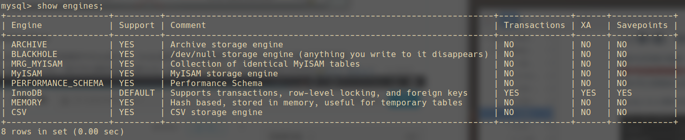

### 1.6 存储层

所有的数据，数据库、表的定义，表的每一行的内容，索引，都是存在 文件系统 上，以 文件 的方式存
在的，并完成与存储引擎的交互。当然有些存储引擎比如InnoDB，也支持不使用文件系统直接管理裸设
备，但现代文件系统的实现使得这样做没有必要了。在文件系统之下，可以使用本地磁盘，可以使用
DAS、NAS、SAN等各种存储系统。

### 1.7 小结

MySQL架构图本节开篇所示。下面为了熟悉SQL执行流程方便，我们可以简化如下：

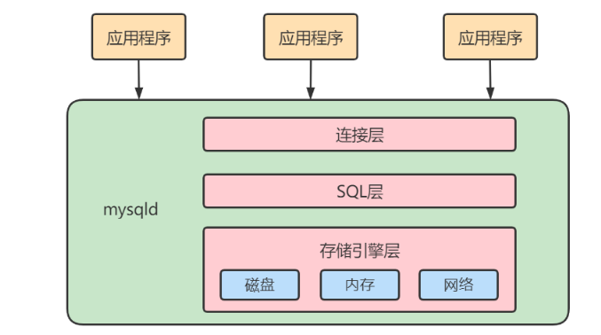


## 2. SQL执行流程

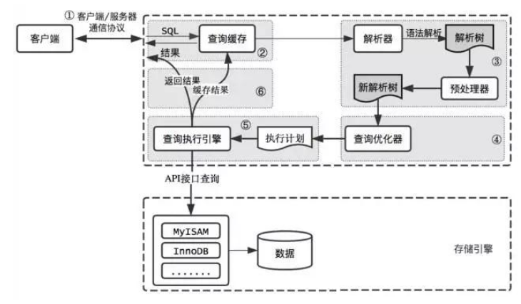

MySQL的查询流程：

1. 查询缓存：Server 如果在查询缓存中发现了这条 SQL 语句，就会直接将结果返回给客户端；如果没
有，就进入到解析器阶段。需要说明的是，因为查询缓存往往效率不高，所以在 MySQL8.0 之后就抛弃
了这个功能。

大多数情况查询缓存就是个鸡肋，为什么呢？

```sql
SELECT employee_id,last_name FROM employees WHERE employee_id = 101;
```

查询缓存是提前把查询结果缓存起来，这样下次不需要执行就可以直接拿到结果。需要说明的是，在MySQL 中的查询缓存，不是缓存查询计划，而是查询对应的结果。这就意味着查询匹配的 `鲁棒性大大降低` ，只有 `相同的查询操作才会命中查询缓存` 。两个查询请求在任何字符上的不同（例如：空格、注释、大小写），都会导致缓存不会命中。因此 MySQL 的 `查询缓存命中率不高` 。
同时，如果查询请求中包含某些系统函数、用户自定义变量和函数、一些系统表，如 mysql 、information_schema、 performance_schema 数据库中的表，那这个请求就不会被缓存。以某些系统函数举例，可能同样的函数的两次调用会产生不一样的结果，比如函数 NOW ，每次调用都会产生最新的当前时间，如果在一个查询请求中调用了这个函数，那即使查询请求的文本信息都一样，那不同时间的两次查询也应该得到不同的结果，如果在第一次查询时就缓存了，那第二次查询的时候直接使用第一次查询的结果就是错误的！

此外，既然是缓存，那就有它 `缓存失效的时候` 。MySQL的缓存系统会监测涉及到的每张表，只要该表的结构或者数据被修改，如对该表使用了 INSERT 、 UPDATE 、 DELETE 、 TRUNCATE TABLE 、 ALTER TABLE 、 DROP TABLE 或 DROP DATABASE 语句，那使用该表的所有高速缓存查询都将变为无效并从高速缓存中删除！对于 `更新压力大的数据库` 来说，查询缓存的命中率会非常低。

**总之, 因为查询缓存往往弊大于利, 查询缓存的失效非常频繁. **

一般建议大家在静态表里使用查询缓存, 什么是静态表, 就是一般极少更新的表. 比如, 一个系统配置表, 字典表, 这张表上的查询才适合使用查询缓存. 好在MySQL也提供这种`按需使用`的方式. 你可以将my.cnf参数query_cache_type设置成DEMEND, 代表当SQL语句中有SQL_CACHE关键词时才使用缓存. 

```sql
query_cache_type=2 # 0 OFF, 1 ON, 2 DEMAND
```

```sql
SELECT SQL_CACHE * FROM test where id=5;

```


2. 解析器：在解析器中对 SQL 语句进行语法分析、语义分析。

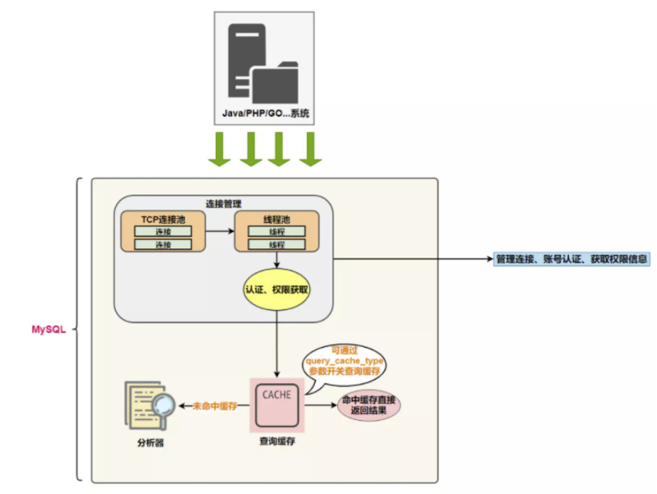

分析器先做“ 词法分析 ”。你输入的是由多个字符串和空格组成的一条 SQL 语句，MySQL 需要识别出里面的字符串分别是什么，代表什么。 MySQL 从你输入的"select"这个关键字识别出来，这是一个查询语句。它也要把字符串“T”识别成“表名 T”，把字符串“ID”识别成“列 ID”。

接着，要做“ 语法分析 ”。根据词法分析的结果，语法分析器（比如：Bison）会根据语法规则，判断你输入的这个 SQL 语句是否 满足 MySQL 语法 。

```sql
select department_id,job_id,avg(salary) from employees group by department_id;
```

如果SQL语句正确，则会生成一个这样的语法树：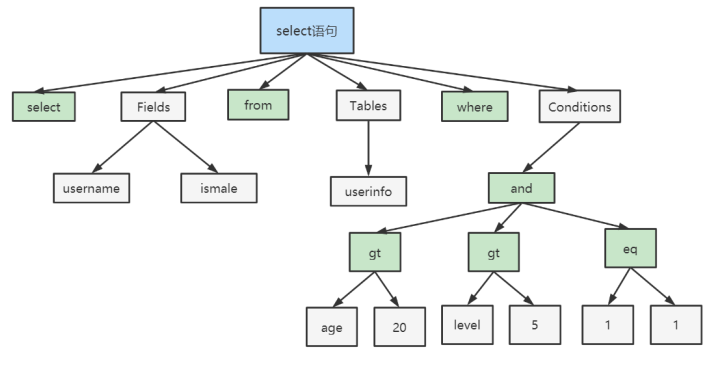

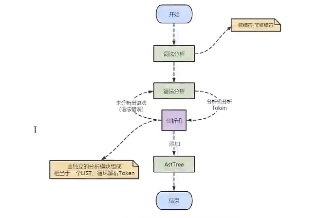

至此解析器的工作任务圆满结束, 进入优化器. 

3. 优化器：在优化器中会确定 SQL 语句的执行路径，比如是根据 全表检索 ，还是根据 索引检索 等。

  经过了解析器, MySQL就知道你要做什么了, 在开始执行之前, 还要经过优化器的处理. ** 一条查询可以有很多种执行方式, 最后都返回相同的结果. 优化器的左右就是找到其中最好的执行计划. 

  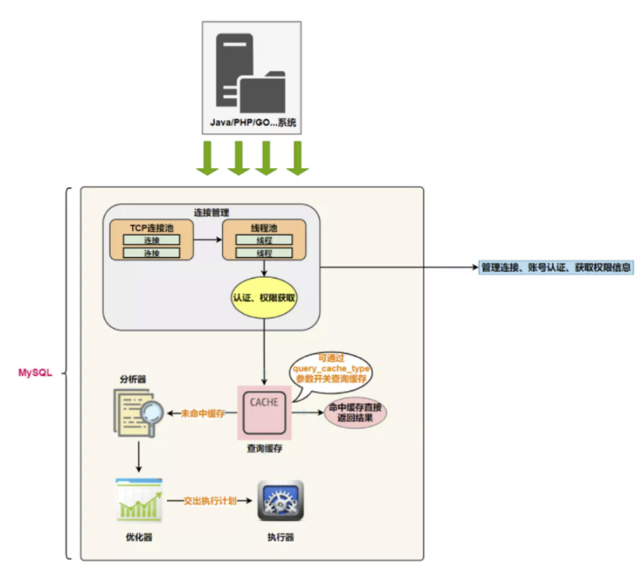

举例：如下语句是执行两个表的 join：

```sql
select * from test1 join test2 using(ID)
where test1.name='zhangwei' and test2.name='mysql高级课程';
```

```sql
方案1：可以先从表 test1 里面取出 name='zhangwei'的记录的 ID 值，再根据 ID 值关联到表 test2，再判
断 test2 里面 name的值是否等于 'mysql高级课程'。
方案2：可以先从表 test2 里面取出 name='mysql高级课程' 的记录的 ID 值，再根据 ID 值关联到 test1，
再判断 test1 里面 name的值是否等于 zhangwei。
这两种执行方法的逻辑结果是一样的，但是执行的效率会有不同，而优化器的作用就是决定选择使用哪一个方案。优化
器阶段完成后，这个语句的执行方案就确定下来了，然后进入执行器阶段。
如果你还有一些疑问，比如优化器是怎么选择索引的，有没有可能选择错等。后面讲到索引我们再谈。
```

在查询优化器中，可以分为 逻辑查询 优化阶段和 物理查询 优化阶段。

逻辑查询优化就是通过改变SQL语句的内容来时的SQL查询更高效, 同时为物理查询优化提供更多的候选执行计划. 同行藏采用的方式是对SQL语句进行等价变换, 对查询进行重写, 而查询重写的数学基础就是关系代数. 对条件表达式进行等价谓词重写, 条件简化, 对试图进行重写, 对子查询进行优化, 对连接语义进行了外连接消除, 嵌套连接消除等. 

物理查询优化是基于关系代数进行的查询重写, 而关系代数的每一步都对应着物理计算, 而这些物理计算往往存在多种算法, 因此需要计算各种物理路径代价, 从中选择代价最小的作为执行计划, 而在这个阶段里, 对于单表和多表的连接操作, 需要高效的使用索引, 提升查询效率. 

4. 执行器：
截止到现在，还没有真正去读写真实的表，仅仅只是产出了一个执行计划。于是就进入了 执行器阶段 。

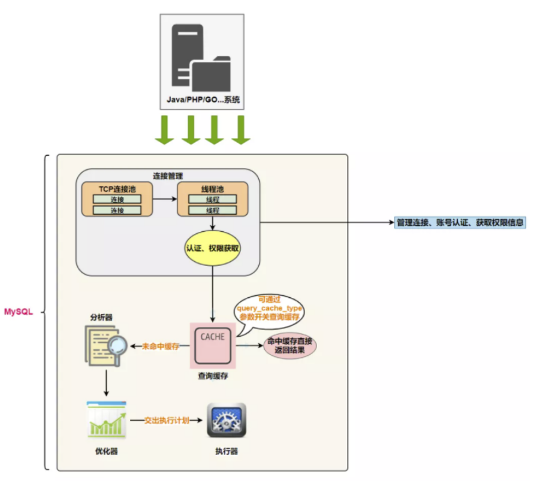

在执行之前需要判断该用户是否 具备权限 。如果没有，就会返回权限错误。如果具备权限，就执行 SQL
查询并返回结果。在 MySQL8.0 以下的版本，如果设置了查询缓存，这时会将查询结果进行缓存。

```sql
select * from test where id=1;
```

如果有权限, 就打开表继续执行. 打开表的时候, 执行器就会根据表的引擎定义, 调用存储引擎API对表进行读写. 存储引擎API只是抽象的借口,下面还有存储引擎层, 具体实现还要看表选择的存储引擎. 

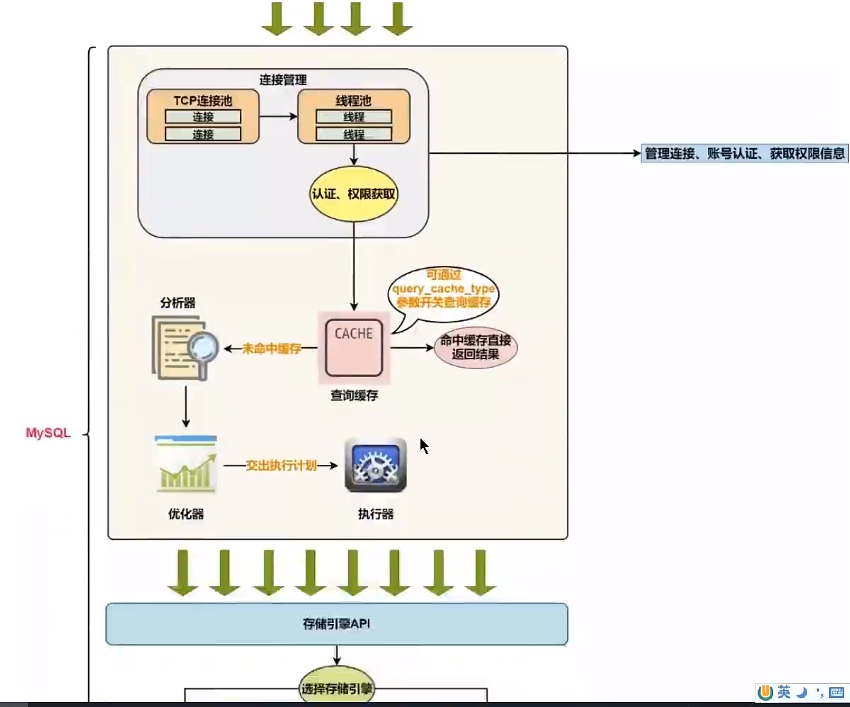

比如：表 test 中，ID 字段没有索引，那么执行器的执行流程是这样的：

```
调用 InnoDB 引擎接口取这个表的第一行，判断 ID 值是不是1，如果不是则跳过，如果是则将这行存在结果集中；
调用引擎接口取“下一行”，重复相同的判断逻辑，直到取到这个表的最后一行。

执行器将上述遍历过程中所有满足条件的行组成的记录集作为结果集返回给客户端。
```

至此，这个语句就执行完成了。对于有索引的表，执行的逻辑也差不多。
SQL 语句在 MySQL 中的流程是： SQL语句→查询缓存→解析器→优化器→执行器 。

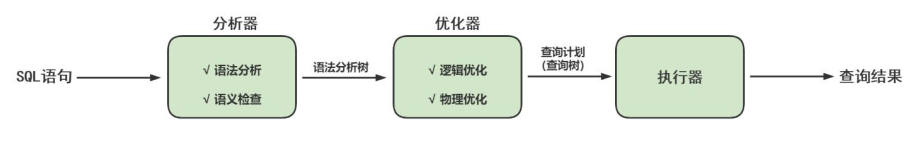

# Chapter 5 存储引擎

## 1. 查看存储引擎

```sql
SHOW engines;
```

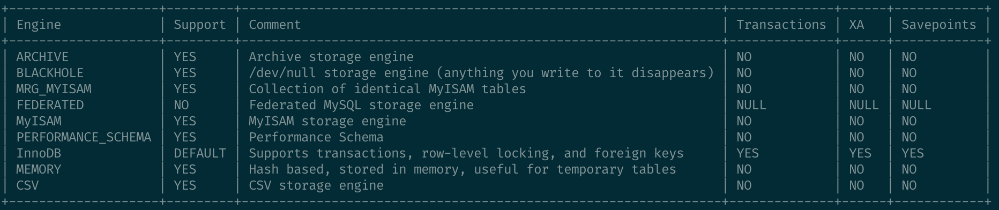

```sql
SHOW engines \G;
```

```sql
mysql> mysql> show engines \G
*************************** 1. row ***************************
      Engine: ARCHIVE
     Support: YES
     Comment: Archive storage engine
Transactions: NO
          XA: NO
  Savepoints: NO
*************************** 2. row ***************************
      Engine: BLACKHOLE
     Support: YES
     Comment: /dev/null storage engine (anything you write to it disappears)
Transactions: NO
          XA: NO
  Savepoints: NO
*************************** 3. row ***************************
      Engine: MRG_MYISAM
     Support: YES
     Comment: Collection of identical MyISAM tables
Transactions: NO
          XA: NO
  Savepoints: NO
*************************** 4. row ***************************
      Engine: FEDERATED
     Support: NO
     Comment: Federated MySQL storage engine
Transactions: NULL
          XA: NULL
  Savepoints: NULL
*************************** 5. row ***************************
      Engine: MyISAM
     Support: YES
     Comment: MyISAM storage engine
Transactions: NO
          XA: NO
  Savepoints: NO
*************************** 6. row ***************************
      Engine: PERFORMANCE_SCHEMA
     Support: YES
     Comment: Performance Schema
Transactions: NO
          XA: NO
  Savepoints: NO
*************************** 7. row ***************************
      Engine: InnoDB
     Support: DEFAULT
     Comment: Supports transactions, row-level locking, and foreign keys
Transactions: YES
          XA: YES
  Savepoints: YES
*************************** 8. row ***************************
      Engine: MEMORY
     Support: YES
     Comment: Hash based, stored in memory, useful for temporary tables
Transactions: NO
          XA: NO
  Savepoints: NO
*************************** 9. row ***************************
      Engine: CSV
     Support: YES
     Comment: CSV storage engine
Transactions: NO
          XA: NO
  Savepoints: NO
9 rows in set (0.00 sec)
```

## 2. 设置默认的存储引擎

- 查看默认的存储引擎:

  ```sql
  SHOW variables LIKE '%storage_engine%';
  SELECT @@default_storage_engine;
  ```

  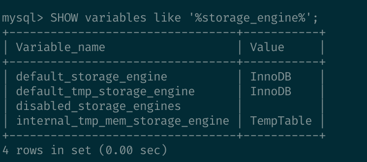

- 修改默认的存储引擎

  如果在创建表的语句中没有显式指定表的存储引擎的话，那就会默认使用 InnoDB 作为表的存储引擎。 如果我们想改变表的默认存储引擎的话，可以这样写启动服务器的命令行:

```sql
SET DEFAULT_STORAGE_ENGINE=MyISAM;
```

或者修改 my.cnf 文件:

```bash
default-storage-engine=MyISAM
# 重启服务
systemctl restart mysqld.service
```

## 3. 设置表的存储引擎

### 3.1 创建表时指定存储引擎

我们之前创建表的语句都没有指定表的存储引擎，那就会使用默认的存储引擎InnoDB 。如果我们想显式的指定一下表的存储引擎，那可以这么写:

```sql
CREATE TABLE 表名( 
  建表语句;
) ENGINE = 存储引擎名称;
```

### 3.2 修改表的存储引擎

如果表已经建好了，我们也可以使用下边这个语句来修改表的存储引擎:

```sql
ALTER TABLE 表名 ENGINE = 存储引擎名称;
```

比如我们修改一下 engine_demo_table 表的存储引擎:

```sql
mysql> ALTER TABLE engine_demo_table ENGINE = InnoDB;
Query OK, 0 rows affected (0.05 sec)
Records: 0  Duplicates: 0  Warnings: 0
```

这时我们再查看一下 engine_demo_table 的表结构:

```sql
mysql> SHOW CREATE TABLE engine_demo_table\G
*************************** 1. row ***************************
       Table: engine_demo_table
Create Table: CREATE TABLE `engine_demo_table` (
  `i` int(11) DEFAULT NULL
) ENGINE=InnoDB DEFAULT CHARSET=utf8
1 row in set (0.01 sec)
```

## 4. 引擎介绍

### 4.1 InnoDB 引擎:具备外键支持功能的事务存储引擎

- MySQL从3.23.34a开始就包含InnoDB存储引擎。 大于等于5.5之后，默认采用InnoDB引擎 。
-  InnoDB是MySQL的 默认事务型引擎 ，它被设计用来处理大量的短期(short-lived)事务。可以确保事务的完整提交(Commit)和回滚(Rollback)。
- 除了增加和查询外，还需要更新、删除操作，那么，应优先选择InnoDB存储引擎。
- **除非有非常特别的原因需要使用其他的存储引擎，否则应该优先考虑**InnoDB**引擎。**
- 数据文件结构：（在《第02章_MySQL数据目录》章节已讲）
  - 表名.frm 存储表结构（MySQL8.0时，合并在表名.ibd中）
  - 表名.ibd 存储数据和索引

- InnoDB是 为处理巨大数据量的最大性能设计 。
  - 在以前的版本中，字典数据以元数据文件、非事务表等来存储。现在这些元数据文件被删除了。比如： .frm ， .par ， .trn ， .isl ， .db.opt 等都在MySQL8.0中不存在了。

- 对比MyISAM的存储引擎， InnoDB写的处理效率差一些 ，并且会占用更多的磁盘空间以保存数据和索引。

- MyISAM只缓存索引，不缓存真实数据；InnoDB不仅缓存索引还要缓存真实数据， 对内存要求较 高 ，而且内存大小对性能有决定性的影响。

### 4.2 MyISAM **引擎：主要的非事务处理存储引擎** 

- MyISAM提供了大量的特性，包括全文索引、压缩、空间函数(GIS)等，但MyISAM 不支持事务、行级 锁、外键 ，有一个毫无疑问的缺陷就是 崩溃后无法安全恢复 。 

- 5.5之前默认的存储引擎

- 优势是访问的 速度快 ，对事务完整性没有要求或者以SELECT、INSERT为主的应用

- 针对数据统计有额外的常数存储。故而 count(*) 的查询效率很高

- 数据文件结构：（在《第02章_MySQL数据目录》章节已讲）

  - 表名.frm 存储表结构

  - 表名.MYD 存储数据 (MYData)

  - 表名.MYI 存储索引 (MYIndex)

- 应用场景：只读应用或者以读为主的业务


# Chapter 6 索引的数据结构

## 1. 为什么使用索引

索引是存储引擎用于快速找到数据记录的一种数据结构, 就好比一本教科书的目录部分, 通过目录中找到对应文章的页码, 便可快速定位到需要的文章, MySQL中也是一样的道理, 进行数据查找时, 首先查看查询条件是否命中某条索引,符合则通过索引查找相关数据, 如果不符合则需要全表扫描, 即需要一条一条的查找记录, 直到找到与条件符合的记录. 

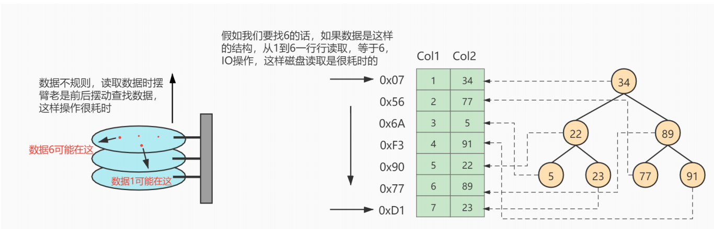

如上图所示, 数据库没有索引的情况下, 数据分布在磁盘的不同的位置上面, 读取数据时, 摆臂需要前后摆动查找数据, 非常消耗时间. 

如果数据顺序摆放, 那么也需要从1到6行按顺序读取, 这样就相当于进行了6次IO操作, 依旧非常耗时.

 如果我们不借助任何索引结构帮助我们快速定位数据的话, 我们查找col2 = 89这条记录, 就要逐行去查找, 比较. 从col2 =34 开始,进行比较, 发现不是, 继续下一行. 我们当前的表只有不到10行数据, 但如果表很大的话, 就意味着要进行很多很多次磁盘I/O才能找到. 

现在要查找col2 = 89这条记录. CPU必须先去磁盘查找这条记录, 找到之后加载到内存, 在对数据进行处理. 这个过程最好时间的就是磁盘I/O(设计磁盘的旋转时间/速度较快, 刺头的寻道时间/ 速度慢费时)

假如给数据使用 二叉树 这样的数据结构进行存储，如下图所示

# 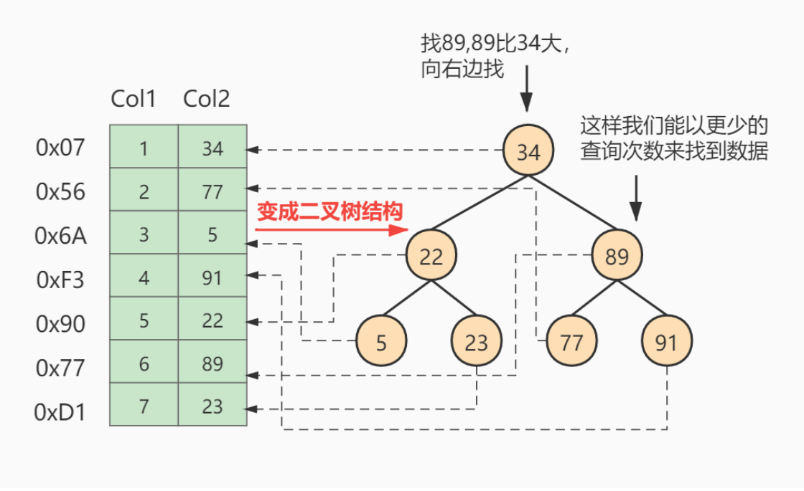

对字段col2 添加了索引,就相当于在磁盘上为col2 维护了一个索引的数据结构, 即这个二叉搜索树. 

二叉搜索树的每个节点存储的是(K,V)结构, key是col2, value是该key所在行的文件指针(地址), 比如:该二叉手所属的节点就是:(34, 0x07). 

现在对col2 添加了索引, 这时再去查找col2=89这条记录时:

1. 先去查找该二叉搜索树(二叉树的遍历查找). 读34到内存, 89>34; 
2. 则继续右侧数据, 读89到内存 89==89; 
3. 找到数据返回, 找到之后就根据当前节点的value快速定位到要查找的记录对应的地址.

我们可以发现, 只要查找两次就可以定位到记录的地址, 查询速度就提高了. 

这就是我们为什么要建索引, 目的就是为了减少磁盘I/O的次数, 加快查询速率. 

### 2. 索引及其优缺点

### 2.1 索引概述

MySQL官方对索引的定义为：**索引（**Index**）是帮助**MySQL**高效获取数据的数据结构**。

**索引的本质：**索引是数据结构。你可以简单理解为“排好序的快速查找数据结构”，满足特定查找算法。这些数据结构以某种方式指向数据， 这样就可以在这些数据结构的基础上实现 `高级查找算法 `。 

索引是在存储引擎中实现的 因此每种存储引擎的索引不一定完全相同, 并且每种存储引擎不一定支持所有索引类型. 同时, 存储引擎可以定义每个表的最大索引树和最大索引长度. 所有存储引擎迟滞每个表至少16个索引, 总索引长度至少为256哥字节, 有些存储引擎支持更过的索引树和更大的索引长度. 

### 2.2 优点 

1. 类似大学图书馆建书目索引，提高数据检索的效率，降低 `数据库的IO成本 `，这也是创建索引最主要的原因。 
2. 通过创建唯一索引，可以保证数据库表中每一行 `数据的唯一性` 。
3. 在实现数据的参考完整性方面，可以 `加速表和表之间的连接` 。换句话说，对于有依赖关系的子表和父表联合查询时，可以提高查询速度。
4. 在使用分组和排序子句进行数据查询时，可以显著 `减少查询中分组和排序的时间` ，降低了CPU的消耗。

### 2.3 缺点

增加索引也有许多不利的方面，主要表现在如下几个方面： 

1. 创建索引和维护索引要 `耗费时间` ，并且随着数据量的增加，所耗费的时间也会增加。
2. 索引需要占 `磁盘空间` ，除了数据表占数据空间之外，每一个索引还要占一定的物理空间，` 存储在磁盘上` ，如果有大量的索引，索引文件就可能比数据文件更快达到最大文件尺寸。
3. 虽然索引大大提高了查询速度，同时却会 `降低更新表的速度` 。当对表中的数据进行增加、删除和修改的时候，索引也要动态地维护，这样就降低了数据的维护速度。

因此，选择使用索引时，需要综合考虑索引的优点和缺点。

> 提示:
>
> 索引可以提高查询的速度, 但是会影响插入记录的速度. 这种情况下, 最好的办法是删除表中的索引, 然后插入数据, 在数据插入完全后再创建索引. 

## 3. InnoDB**中索引的推演**

### 3.1 索引之前的查找

先来看一个精确匹配的例子：

```sql
SELECT [列名列表] FROM 表名 WHERE 列名 = xxx; 
```

1. **在一个页中的查找** 

   假设目前表中的记录比较少, 所有记录都可以放在一个页中(一页空间16KB), 在查找记录的时候可以根据搜索条件的不同分为两种情况:

   - 以主键为搜索条件

     可以在页目录中使用二分法快速定位到对应的槽, 然后再遍历该槽对应分组中的记录即可快速找到制定的记录.

   - 已其他列为搜索条件

     因为在数据页中并没有对非主键建立所谓的页目录, 所以我们无法通过二分法快速定位相应的槽. 这种情况下只能从最小记录开始依次遍历单链表中的每条记录, 然后对比记录是不是符合搜索条件. 很显然,这种查找的效率是非常低的. 

   

2. **在很多页中查找**

在没有索引的情况下，不论是根据主键列或者其他列的值进行查找，由于我们并不能快速的定位到记录所在的页，所以只能 `从第一个页` 沿着 `双向链表` 一直往下找，在每一个页中根据我们上面的查找方式去查找指定的记录。因为要遍历所有的数据页，所以这种方式显然是 `超级耗时` 的。如果一个表有一亿条记录呢？此时 `索引` 应运而生。

### 3.2 设计索引

建一个表

```sql
mysql> CREATE TABLE index_demo(
-> c1 INT,
-> c2 INT,
-> c3 CHAR(1),
-> PRIMARY KEY(c1)
-> ) ROW_FORMAT = Compact;
```

这个新建的 `index_demo` 表中有2个INT类型的列，1个CHAR(1)类型的列，而且我们规定了c1列为主键，这个表使用 `Compact` 行格式来实际存储记录的。这里我们简化了index_demo表的行格式示意图：

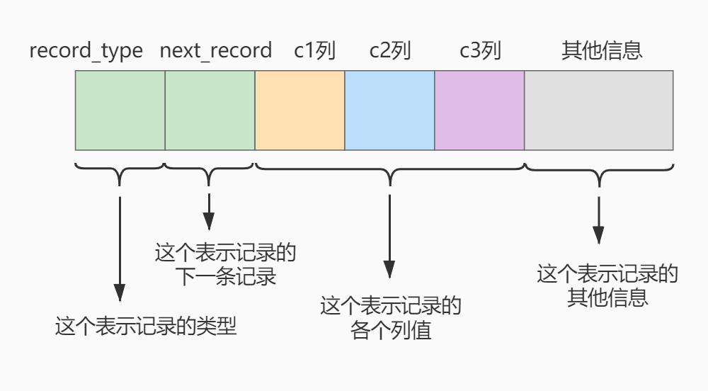

我们只在示意图里展示记录的这几个部分 

- record_type:记录头信息的一项属性,表示记录的类型 , 0 表示普通记录、2 表示最小记录 、3 表示最大记录、1 暂时还没用用过, 下面讲。

- next_record ：记录头信息的一项属性，表示下一条地址相对于本条记录的地址偏移量，我们用箭头来表明下一条记录是谁。

- 各个列的值 ：这里只记录在 index_demo 表中的三个列，分别是 c1 、 c2 和 c3 。 

- 其他信息 ：除了上述3种信息以外的所有信息，包括其他隐藏列的值以及记录的额外信息。

  将记录格式示意图的其他信息项暂时去掉并把它竖起来的效果就是这样：

  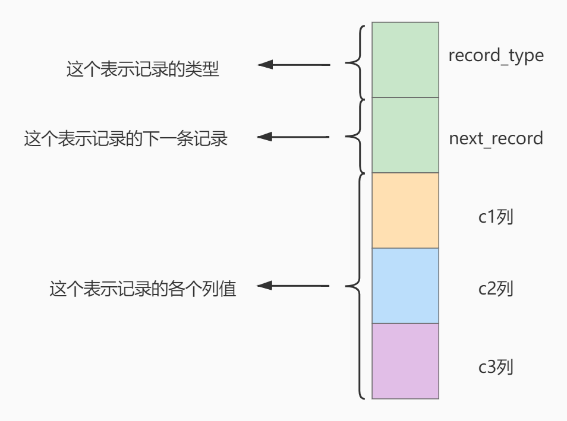

把一些记录放在页里的示意图就是:

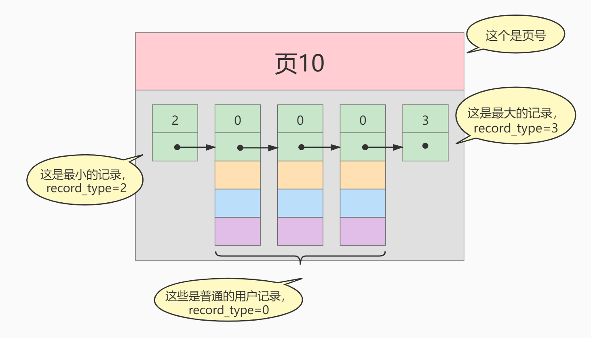

## 1. 一个简单的索引设计方案

我们在根据某个搜索条件查找一些记录时为什么要遍历所有的数据页呢？因为各个页中的记录并没有规律，我们并不知道我们的搜索条件匹配哪些页中的记录，所以不得不依次遍历所有的数据页。所以如果我们 想快速的定位到需要查找的记录在哪些数据页 中该咋办？我们可以为快速定位记录所在的数据页而 建 立一个目录 ，建这个目录必须完成下边这些事：

- 下一个数据页中用户记录的主键值必须大于上一个页中用户记录的主键值。

  假设: 每个数据也最多能存放3条记录(实际一个数据页非常大, 可以存放好多记录, 我们像index_demo表出入3条记录), 主键递增的顺序.

  ```sql
  mysql > INSERT INTO index_demo VALUES(1, 4, 'u'), (3, 9, 'd'), (5,3,'y');
  Query OK, 3 rows affected (0.01 sec)
  Records: 3 Duplicates: 0  Warnings: 0
  ```

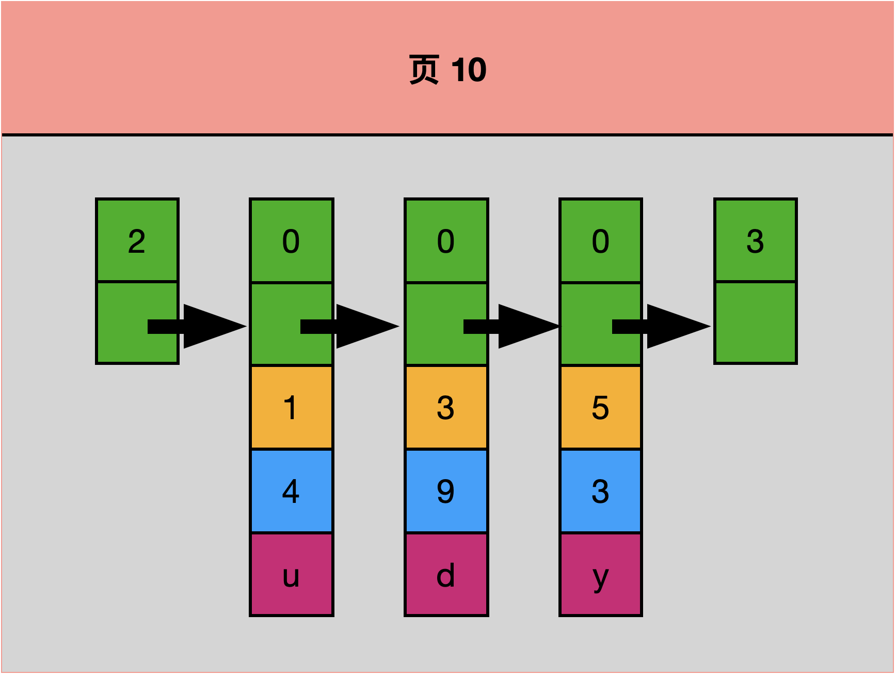

从图中可以看出来, index_demo表中的3条记录都被插入到编号为10的数据页中, 此时我们再来插入一条记录

```sql
mysql> INSERT INTO index_demo VALUES(4,4,'a');
```

因为页10最多只能放3条记录, 所以我们需要再分配一个新页. 


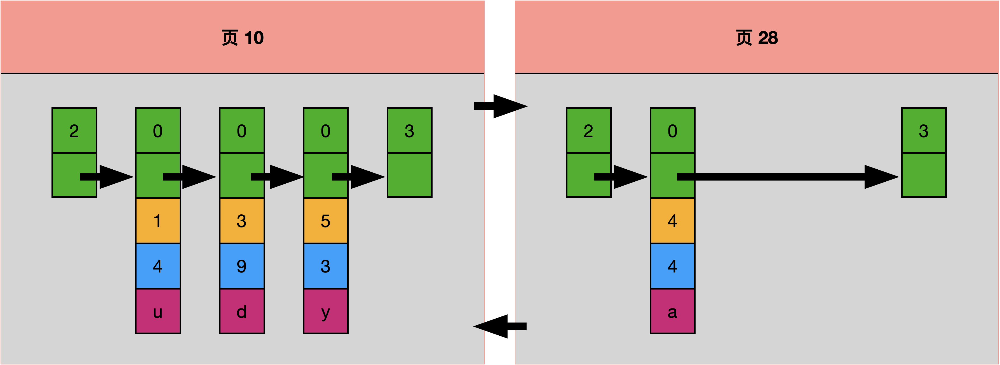

注意, 新分配的数据页编号可能并不是连续的, 他们只是通过维护者上一个页和下一个页的编号二建立了链表关系. 另外, 页10中用户记录最大的主键值是5, 而页28中有一条记录的主键值是4, 因为5>4, 所以这里就不符合下一个数据页中用户记录的主键值必须大于上一个页面中用户记录的主键值的要求, 所以在插入主键值为4的记录的时候需要在伴随一次记录移动. 也就是吧主键值为5的记录移动到页28中, 然后再把主键值为4的记录插入到页10中, 这个过程的示意图如下. 

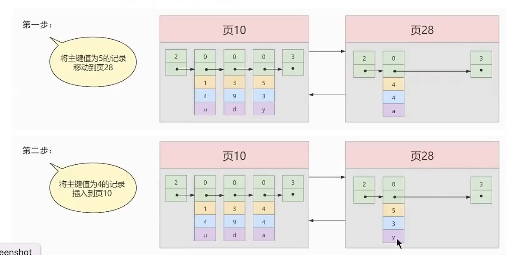

这个过程表明了在对页中的记录进行增删改操作的过程中, 我们必须通过一些诸如记录移动的操作来始终保证这个状态一直成立: 下一个数据页中用户记录的主键值必须大于上一个页中用户记录的主键值. 这个过程我们成为分页裂.(page split ?)

- 给所有的页建立一个目录项.

  由于数据页的编号可能是不连续的, 所以在想index_demo表中插入许多条记录后, 可能是这样的效果

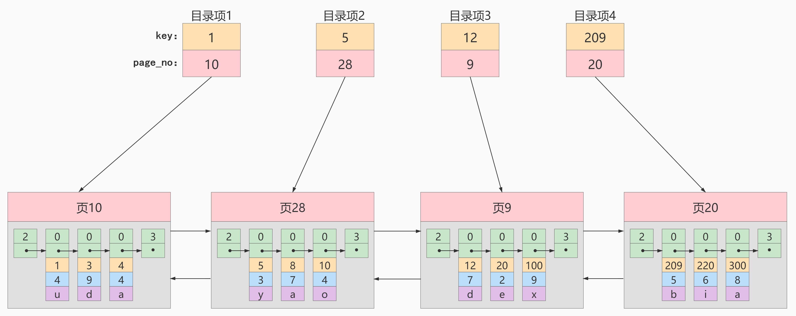

因为这些16KB的页在物理存储上是不连续的, 所以如果想从这么多页中根据主键值快速定位某些记录所在的页, 我们需要给他们做个目录, 每个页对应一个目录项, 每个项目包括下边两个部分. 

1. 页的用户记录中最小的主键值, 我们用key来表示.
2. 页号, 我们用page_no表示. 

以 `页28` 为例，它对应 `目录项2` ，这个目录项中包含着该页的页号 `28` 以及该页中用户记录的最小主键值 `5` 。我们只需要把几个目录项在物理存储器上连续存储（比如：数组），就可以实现根据主键值快速查找某条记录的功能了。比如：查找主键值为 20 的记录，具体查找过程分两步：

1. 先从目录项中根据 `二分法` 快速确定出主键值为 `20` 的记录在 `目录项3` 中（因为 `12 < 20 < 209` ），它对应的页是 `页9` 。 

2. 再根据前边说的在页中查找记录的方式去 `页9` 中定位具体的记录。

至此，针对数据页做的简易目录就搞定了。这个目录有一个别名，称为 `索引` 。 

### 2. InnoDB**中的索引方案** 

1. 迭代1次：目录项纪录的页

上边称为一个简易的索引方案, 是因为我们为了在根据主键值进行查找时使用二分法快速定位具体的目录项而假设所有目录项都可以在物理存储器上连续存储, 但是这样做就有几个问题:

- InnoDB是使用页来作为管理存储空间的基本单位, 最多保证16KB的连续存储空间, 而随着表中记录数量的增多, 需要非常大的连续存储空间次啊能吧所有的目录项都放下, 而这对记录数量非常多的表是不现实的. 
- 我们时常会对记录进行增删, 假设我们把原页28中的记录全部删除, 那意味着目录项2也就没有存在的必要了, 这就需要把目录项2后的目录项都向前移动一下, 这样牵一发而动全身的操作效率很差. 

所以, 我们需要一种可以灵活管理所有目录项的方式, 我们发现目录项其实长的与我们的用户记录差不多, 只不过目录项中的两列是主键和页号而已, 为了和用户记录做一下区分, 我们把这些用来表示目录项的记录称为目录项记录. 那InnoDB怎么区分一条记录是普通的用户记录还是目录项记录呢? 使用记录都心系里的record_type属性, 他的各个取值代表的意思如下:

- 0: 普通的用户记录
- 1: 目录项记录
- 2: 最小记录
- 3: 最大记录

我们把前边使用到的目录项放到数据页中的样子就是这样：

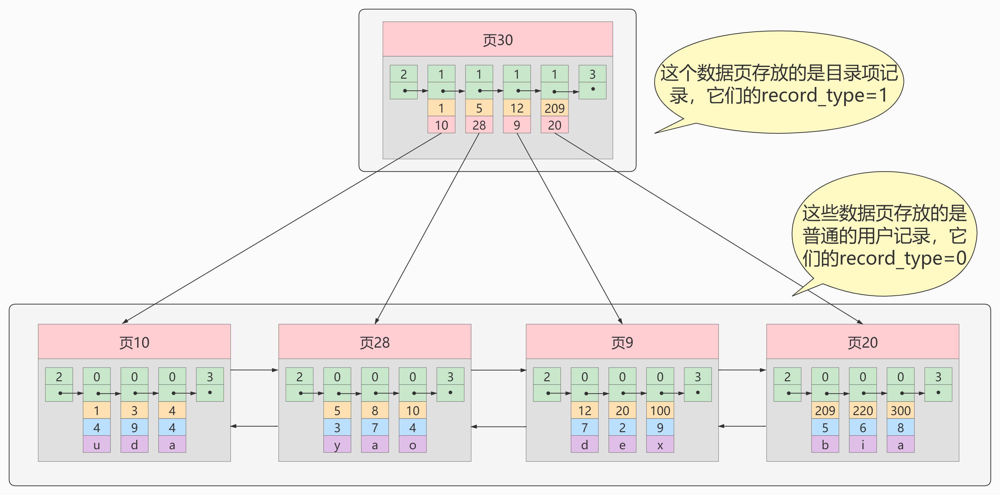

从图中可以看出来，我们新分配了一个编号为30的页来专门存储目录项记录。这里再次强调 目录项记录和普通的 `用户记录` 的**不同点**： 

- `目录项记录` 的 `record_type` 值是1，而 `普通用户记录` 的 `record_type` 值是0。

- 目录项记录只有 主键值和页的编号 两个列，而普通的用户记录的列是用户自己定义的，可能包含 很多列 ，另外还有InnoDB自己添加的隐藏列。

- 了解：记录头信息里还有一个叫 min_rec_mask 的属性，只有在存储 目录项记录 的页中的主键值最小的 目录项记录 的 min_rec_mask 值为 1 ，其他别的记录的 min_rec_mask 值都是 0 。

**相同点：**两者用的是一样的数据页，都会为主键值生成 Page Directory （页目录），从而在按照主键值进行查找时可以使用 二分法 来加快查询速度。

现在以查找主键为 20 的记录为例，根据某个主键值去查找记录的步骤就可以大致拆分成下边两步：

1. 先到存储 `目录项记录` 的页，也就是页30中通过 `二分法` 快速定位到对应目录项，因为 `12 < 20 < 209` ，所以定位到对应的记录所在的页就是页9。 

2. 再到存储用户记录的页9中根据 `二分法`快速定位到主键值为 `20` 的用户记录。

2. 迭代2次：多个目录项纪录的页

虽然说目录项记录中只存储主键值和对应的页号, 比用户记录需要的存储空间小很多, 但是不论怎么说一个页只有16KB大小, 能存放的目录项记录也是有限的, 那如果表中的数据太多, 以至于一个数据页不足以存放所有的目录项记录, 如何处理呢?


我们假设一个存储目录项记录的页最多存放4条目录项记录, 所以如果此时我们再向上图中插入一条主键值为320的用户记录的话, 那就需要分配一个新的存储目录项记录的页:

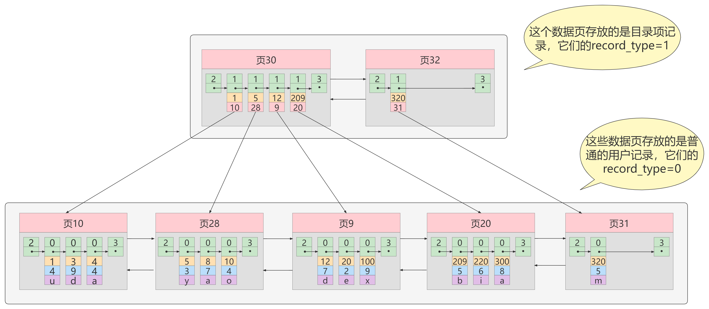

从图中可以看出，我们插入了一条主键值为320的用户记录之后需要两个新的数据页：

- 为存储该用户记录而新生成了 `页31` 。

- 因为原先存储目录项记录的 `页30的容量已满` （我们前边假设只能存储4条目录项记录），所以不得不需要一个新的 `页32` 来存放 `页31` 对应的目录项。

现在因为存储目录项记录的页不止一个，所以如果我们想根据主键值查找一条用户记录大致需要3个步骤，以查找主键值为 20 的记录为例：

1. 确定 `目录项记录页`

我们现在的存储目录项记录的页有两个，即 `页30` 和 `页32` ，又因为页30表示的目录项的主键值的范围是 `[1, 320)` ，页32表示的目录项的主键值不小于 `320` ，所以主键值为 20 的记录对应的目录项记录在 `页30` 中。

2. 通过目录项记录页 `确定用户记录真实所在的页` 。

在一个存储 `目录项记录` 的页中通过主键值定位一条目录项记录的方式说过了。

3. 在真实存储用户记录的页中定位到具体的记录。

3. 迭代3次: 目录项记录页的目录页

   问题来了, 在这个查询步骤的第一步中我们需要定位存储目录项记录的页, 但这些`页是不连续的`, 如果我们表中的数据非常多则会`产生很多存储目录项记录的页`, 那我们怎么根据主键值快速定位一个存储目录项记录的页呢?那就为这些存储目录项记录的页在生成一个`更高级的目录`, 就像是个多级目录一样, `大目录里嵌套小目录`, 小目录里次啊是实际的数据, 所以现在各个页的示意图就是这个样子:

   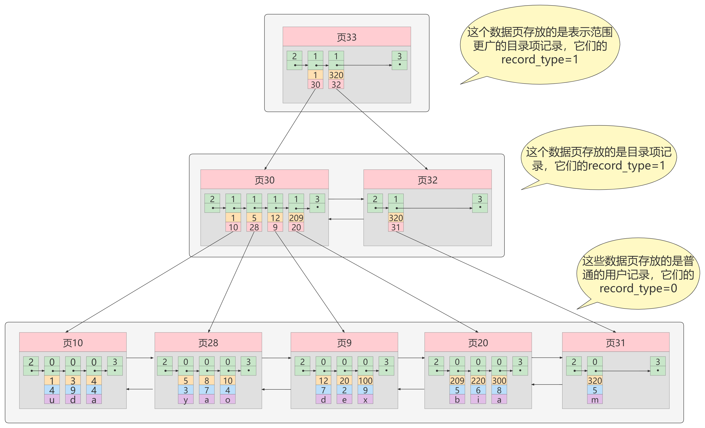

如图，我们生成了一个存储更高级目录项的 `页33 `，这个页中的两条记录分别代表页30和页32，如果用户记录的主键值在 `[1, 320)` 之间，则到页30中查找更详细的目录项记录，如果主键值 `不小于320` 的话，就到页32中查找更详细的目录项记录。

随着表中记录的增加, 这个目录的层级会继续增加, 如果简化一下, 那么我们我可以用下面这个图来描述他:

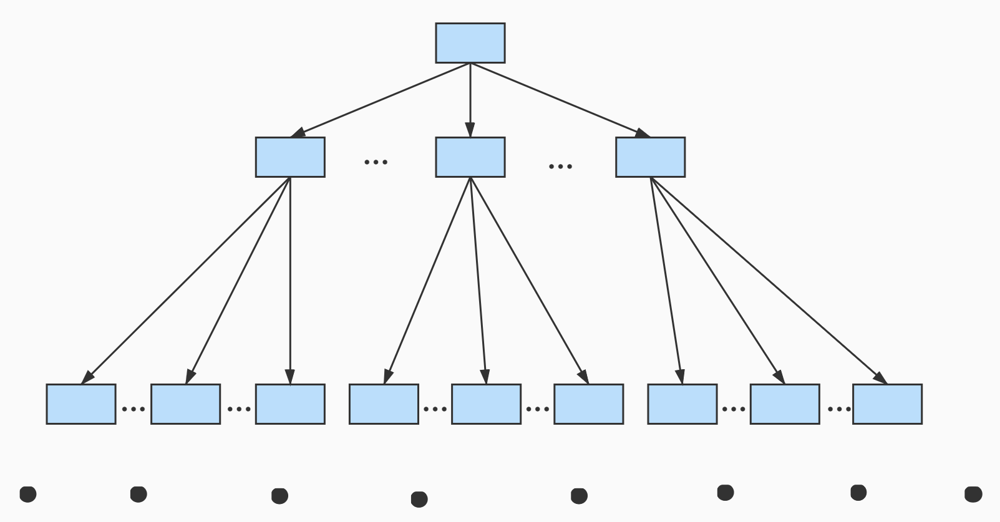

这个数据结构，它的名称是 `B+树 `。 

4. B+Tree

一个B+树的节点其实可以分成好多层，规定最下边的那层，也就是存放我们用户记录的那层为第 0 层，之后依次往上加。之前我们做了一个非常极端的假设：存放用户记录的页 `最多存放3条记录` ，存放目录项记录的页 `最多存放4条记录` 。其实真实环境中一个页存放的记录数量是非常大的，`假设`所有存放用户记录的叶子节点代表的数据页可以存放 `100条用户记录` ，所有存放目录项记录的内节点代表的数据页可以存放` 1000条目录项记录` ，那么：

- 如果B+树只有1层，也就是只有1个用于存放用户记录的节点，最多能存放 100 条记录。
- 如果B+树有2层，最多能存放 `1000×100=10,0000` 条记录。

- 如果B+树有3层，最多能存放 `1000×1000×100=1,0000,0000` 条记录。

- 如果B+树有4层，最多能存放 `1000×1000×1000×100=1000,0000,0000 `条记录。相当多的记录！！！

你的表里能存放 `100000000000` 条记录吗？所以一般情况下，我们 用到的B+树都不会超过4层 ，那我们通过主键值去查找某条记录最多只需要做4个页面内的查找（查找3个目录项页和一个用户记录页），又因为在每个页面内有所谓的 `Page Directory` （页目录），所以在页面内也可以通过 二分法 实现快速定位记录。

### 3.3 常见索引概念

索引按照物理实现方式，索引可以分为 2 种：聚簇（聚集）和非聚簇（非聚集）索引。我们也把非聚集索引称为二级索引或者辅助索引。

1. 聚簇索引

聚簇索引并不是一种单独的索引类型, 而是一种数据存储方式(所有的用户记录都存储在了叶子节点Leaf node), 也就是所谓的索引即数据,数据即索引.

> 术语聚簇 表示数据行和相邻的键值聚簇的的存储在一起

**特点：**

1. 使用记录主键值的大小进行记录和页的排序，这包括三个方面的含义：
   - `页内` 的记录是按照主键的大小顺序排成一个 `单向链表` 。
   - 各个存放 `用户记录的页` 也是根据页中用户记录的主键大小顺序排成一个 `双向链表` 。
   - 存放 `目录项记录的页` 分为不同的层次，在同一层次中的页也是根据页中目录项记录的主键大小顺序排成一个 `双向链表` 。 

2. B+树的 `叶子节点` 存储的是完整的用户记录。

   所谓完整的用户记录，就是指这个记录中存储了所有列的值（包括隐藏列）。

   

我们把具有这两种特性的B+树称为`聚簇索引`, 所有完整的用户记录都存放在这个`聚簇索引`的叶子节点处. 这种聚簇索引并不需要我们在MySQL语句中显示的使用`INDEX`语句去创建, `InnoDB`存储引擎会`自动`的为我们创建聚簇索引. 

**优点：**

- `数据访问更快` ，因为聚簇索引将索引和数据保存在同一个B+树中，因此从聚簇索引中获取数据比非聚簇索引更快

- 聚簇索引对于主键的 `排序查找` 和` 范围查找` 速度非常快

- 按照聚簇索引排列顺序，查询显示一定范围数据的时候，由于数据都是紧密相连，数据库不用从多个数据块中提取数据，所以 `节省了大量的io操作` 。

**缺点：**

- 插入速度严重依赖于插入顺序 ，按照主键的顺序插入是最快的方式，否则将会出现页分裂，严重影响性能。因此，对于InnoDB表，我们一般都会定义一个**自增的**ID**列为主键**

- 更新主键的代价很高 ，因为将会导致被更新的行移动。因此，对于InnoDB表，我们一般定义**主键为不可更新**

- 二级索引访问需要两次索引查找 ，第一次找到主键值，第二次根据主键值找到行数据

**限制:**

- 对于MySQL数据库目前只有InnoDB数据引擎支持聚簇索引, 而MyISAM并不支持聚簇索引

- 对于数据物理存储排序方式只能有一种, 所以每个MySQL的`表只能有一个聚簇索引`. 一般情况下就是该表的主键. 

- 如果没有定义主键, InnoDB会选择`非空的唯一索引`代替. 如果没有这样的索引, InnoDB会隐式的定义一个主键来作为聚簇索引. 

- 为了允许利用聚簇索引的聚簇的特性, 所以InnoDB表的主键尽量`选用有序的序列id`, 而不建议用无序的id, 比如UUID, MD5, HASH,字符串作为主键无法保证数据的顺序增长. 

  

2. 二级索引（辅助索引、非聚簇索引）

   上边介绍的聚簇索引只能在搜索条件是主键值时才能发挥作用, 因为B+树中的数据都是按照主键进行排序的, 那如果我们像以别的列作为搜索条件怎么办呢? 肯定不能是从头到位沿着链表遍历记录一遍.

   答案: 我们可以`多建几个B+树`, 不同的B+树中的数据采用不用的排序规则. 比方说我们用`c2`列的大小作为数据页, 页中记录的排序, 再建一棵B+树, 效果如下图所示:

   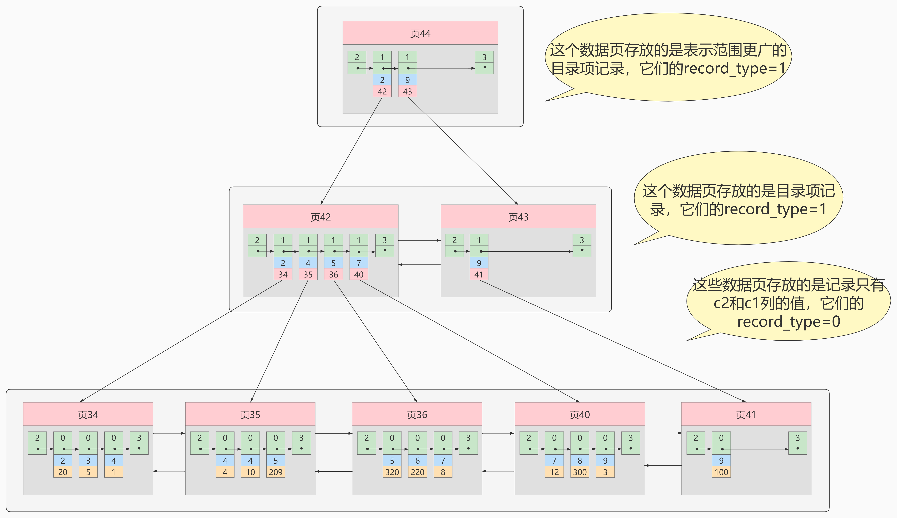

这个B+树与上边介绍的聚簇索引有几处不同:

- 使用记录c2列的大小进行记录和页的排序, 这包括三个方面的含义:
  - 业内的记录是按照c2列的大小顺序排成一个单向链表
  - 各个存放用户记录的页也是根据页中记录的c2列大小顺序排成一个双向链表
  - 存放用户记录的页分为不同层次,在同一层次中的页也是根据页中目录项记录的c2列大小顺序排成一个双向链表
- B+树的叶子节点存储的并不是完整的用户记录, 而知识c2列+主键这两个列的值
- 目录项记录中不再是主键+页号的搭配, 而变成了c2列+页号的搭配. 

所以如果我们现在想通过c2列的值查找某些记录的话, 就可以使用我们刚刚建好的这个B+树了, 以查找c2列的值为4的记录为例, 查找过程如下:

1. 确定目录项记录页

   根据根页面, 也就是页44, 可以快速定位到目录记录所在的页为页43(因为2<4<9).

2. 根据目录项记录页确定用户记录真实所在的页.

   在页42中可以快速定位到实际存储用户记录的页, 但是由于c2列并没有唯一性约束, 所以c2列值为4的记录可能分布在多个数据页中, 又因为2<4<=4, 所以确定世纪存储用户记录的页在页34和页35中

3. 在真实存储用户记录的页中定位到具体的记录

   到页34和页35中定位到具体的记录.

4. 但这个B+树的叶子节点中的记录只存储了c2和c1(主键)两个列, 所以我们必须在根据主键值去聚簇索引中再查找一遍完整的用户记录. 

**概念：回表** 我们根据这个以c2列大小排序的B+树只能确定我们要查找记录的主键值，所以如果我们想根据c2列的值查找到完整的用户记录的话，仍然需要到 `聚簇索引` 中再查一遍，这个过程称为 `回表` 。也就是根据c2列的值查询一条完整的用户记录需要使用到 2 棵B+树！

**问题：**为什么我们还需要一次 `回表 `操作呢？直接把完整的用户记录放到叶子节点不OK吗？

回答: 如果把完整的用户记录放到叶子节点是可以不用回表, 但是太占空间, 相当于每建一棵B+树, 都需要把所有的用户记录都在拷贝一遍, 这就有点太浪费存储空间了. 

因为这种按照非主键列建立的B+树需要一次回表操作才可以定位到完整的用户记录, 所以这种B+树也被称为二级索引(secondary index) 或辅助索引. 由于我们使用的是c2列的大小作为B+树的排序规则, 所以我们也称这个B+树是为c2列建立的索引.

非聚簇索引的存在, 不影响数据在聚簇索引中的组织, 所以一张表可以有多个非聚簇索引. 


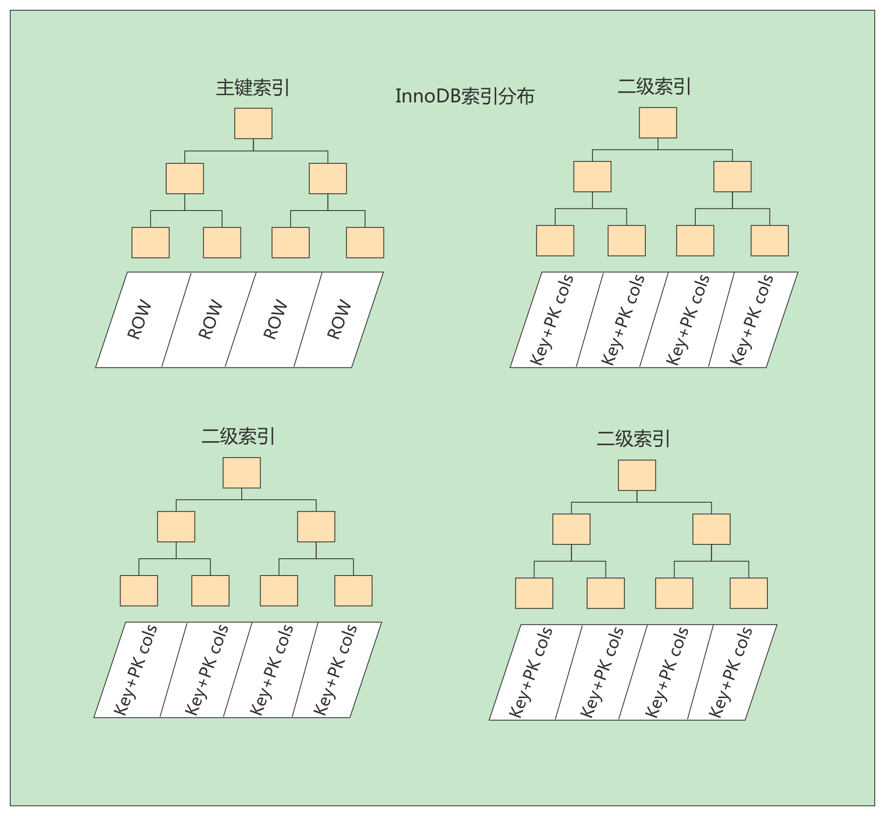

3. 联合索引

我们也可以同时以多个列的大小作为排序规则，也就是同时为多个列建立索引，比方说我们想让B+树按照 c2和c3列 的大小进行排序，这个包含两层含义：

- 先把各个记录和页按照c2列进行排序。

- 在记录的c2列相同的情况下，采用c3列进行排序

注意一点，以c2和c3列的大小为排序规则建立的B+树称为 联合索引 ，本质上也是一个二级索引。它的意思与分别为c2和c3列分别建立索引的表述是不同的，不同点如下：

建立 联合索引 只会建立如上图一样的1棵B+树。

为c2和c3列分别建立索引会分别以c2和c3列的大小为排序规则建立2棵B+树。

3.4 InnoDB**的**B+**树索引的注意事项** 

\1. **根页面位置万年不动** 

\2. **内节点中目录项记录的唯一性** 

\3. **一个页面最少存储**2**条记录** 

# Chapter 8

## 1. 索引的声明与使用

### 1.1 索引的分类

### 1.2 创建索引

#### 1.2.1 创建表的时候创建索引

##### 1.2.1.1 创建普通索引

##### 1.2.1.2 创建唯一索引

##### 1.2.1.3 主键索引

##### 1.2.1.4 创建单列索引

##### 1.2.1.5 创建组合索引

##### 1.2.1.6 创建全文索引

##### 1.2.1.7 创建空间索引

#### 1.2.2 在已存在的表上创建索引

##### 1.2.2.1使用ALTER TABLE语句创建索引

##### 1.2.2.2 使用CREATE INDEX 创建索引

### 1.3 删除索引

#### 1.3.1 使用ALTER TABLE 删除索引

#### 1.3.2 使用DROP INDEX删除索引

## 2. MySQL8.0 索引新特性

### 2.1 支持降序索引

### 2.2 隐藏索引

在MySQL 5.7版本及之前，只能通过显式的方式删除索引。此时，如果发现删除索引后出现错误，又只能通过显式创建索引的方式将删除的索引创建回来。如果数据表中的数据量非常大，或者数据表本身比较大，这种操作就会消耗系统过多的资源，操作成本非常高。

从MySQL 8.x开始支持 隐藏索引（invisible indexes） ，只需要将待删除的索引设置为隐藏索引，使查询优化器不再使用这个索引（即使使用force index（强制使用索引），优化器也不会使用该索引），确认将索引设置为隐藏索引后系统不受任何响应，就可以彻底删除索引。 这种通过先将索引设置为隐藏索 引，再删除索引的方式就是软删除 。

#### 2.2.1 创建表时直接创建

在MySQL中创建隐藏索引通过SQL语句INVISIBLE来实现，其语法形式如下：

```sql
CREATE TABLE tablename( 
  propname1 type1[CONSTRAINT1], 
  propname2 type2[CONSTRAINT2],
  ……
  propnamen typen, 
  INDEX [indexname](propname1 [(length)]) INVISIBLE 
);
```

上述语句比普通索引多了一个关键字INVISIBLE，用来标记索引为不可见索引。

#### 2.2.2 在已经存在的表上创建

``` sql
CREATE INDEX indexname
ON tablename(propname[(length)]) INVISIBLE;
```

#### 2.2.3 通过ALTER TABLE语句创建

```sql
ALTER TABLE tablename
ADD INDEX indexname(propname [(length)]) INVISIBLE;
```

#### 2.2.4 切换索引可见状态

```sql
ALTER TABLE tablename ALTER INDEX index_name INVISIBLE;
ALTER TABLE tablename ALTER INDEX index_name VISIBLE;
```

>注意 当索引被隐藏时，它的内容仍然是和正常索引一样实时更新的。如果一个索引需要长期被隐藏，那么可以将其删除，因为索引的存在会影响插入、更新和删除的性能。

## 3. 索引的设计原则

### 3.1 数据准备

创建库、创建表

```sql
CREATE DATABASE atguigudb1; 
USE atguigudb1; 
#1.创建学生表和课程表 
CREATE TABLE `student_info` (
  `id` INT(11) NOT NULL AUTO_INCREMENT, 
  `student_id` INT NOT NULL , 
  `name` VARCHAR(20) DEFAULT NULL, 
  `course_id` INT NOT NULL , 
  `class_id` INT(11) DEFAULT NULL, 
  `create_time` DATETIME DEFAULT CURRENT_TIMESTAMP ON UPDATE CURRENT_TIMESTAMP, 
  PRIMARY KEY (`id`) 
) ENGINE=INNODB AUTO_INCREMENT=1 DEFAULT CHARSET=utf8;
  
CREATE TABLE `course` (
  `id` INT(11) NOT NULL AUTO_INCREMENT, 
  `course_id` INT NOT NULL , 
  `course_name` VARCHAR(40) DEFAULT NULL, 
  PRIMARY KEY (`id`) 
) ENGINE=INNODB AUTO_INCREMENT=1 DEFAULT CHARSET=utf8;
```

创建模拟数据必需的存储函数

```sql
DELIMITER //
CREATE FUNCTION rand_string(n INT)
	RETURNS VARCHAR(255)
BEGIN 
	DECLARE chars_str VARCHAR(100) DEFAULT 'abcdefghijklmnopqrstuvwxyzABCDEFJHIJKLMNOPQRSTUVWXYZ';
	DECLAre return_str VARCHAR(255) DEFAULT ''; 
	DECLARE i INT DEFAULT 0;
	WHILE i < n DO
		SET return_str = CONCAT(return_str, SUBSTRING(chars_str, FLOOR(1+RAND()* 52), 1));
		SET i = i + 1;
	END WHILE;
	RETURN return_str;
END //
DELIMITER ;
```

```sql
DELIMITER //
CREATE FUNCTION rand_num(from_num INT, to_num INT)
RETURNS INT(11)
BEGIN
	DECLARE i INT DEFAULT 0;
	SET i = FLOOR(from_num + RAND()*(to_num - from_num +1));
	RETURN i;
END //
DELIMITER ;
```

创建函数，假如报错：

This function has none of DETERMINISTIC......

由于开启过慢查询日志bin-log, 我们就必须为我们的function指定一个参数。

主从复制，主机会将写操作记录在bin-log日志中。从机读取bin-log日志，执行语句来同步数据。如果使用函数来操作数据，会导致从机和主键操作时间不一致。所以，默认情况下，mysql不开启创建函数设置。

查看mysql是否允许创建函数：

```sql
show variables like 'log_bin_trust_function_creators'
```

命令开启：允许创建函数设置：

```sql
set global log_bin_trust_function_creators=1; # 不加global只是当前窗口有效。
```

mysqld重启，上述参数又会消失。永久方法：

windows下：my.ini[mysqld]加上：

linux下：/etc/my.cnf下my.cnf[mysqld]加上：

```sql
log_bin_trust_function_creators=1 
```

第3步：创建插入模拟数据的存储过程

```sql
# 存储过程1：创建插入课程表存储过程
DELIMITER //
CREATE PROCEDURE insert_course(max_num INT)
BEGIN
	DECLARE i INT DEFAULT 0;
	SET autocommit = 0; # set manual commit
	REPEAT					#loop
		SET i = i + 1;
		INSERT INTO course(course_id, course_name) 
		VALUES(rand_num(1000, 10100), rand_string(6));
		UNTIL i = max_num
	END REPEAT;
	COMMIT; # manual commit
END //
DELIMITER ;
```

```sql
# 存储过程2：创建插入学生信息表存储过程
DELIMITER //
CREATE PROCEDURE insert_stu(max_num INT)
BEGIN
	DECLARE i INT DEFAULT 0;
	SET autocommit = 0;
	REPEAT 
		SET i = i + 1;
		INSERT INTO student_info(course_id, class_id, student_id, NAME) 
		VALUES(rand_num(10000, 10100), rand_num(10000, 102000), rand_num(1, 200000), rand_string(6));
		UNTIL i = max_num
		END REPEAT;
		COMMIT;
END //
DELIMITER ;

```

第4步：调用存储过程

```sql
CALL insert_course(100); 
CALL insert_stu(1000000);
```


### 3.2 那些情况适合创建索引

1. **字段的数值有唯一性的限制**

> **业务上具有唯一特性的字段**，即使是组合字段，也必须建成唯一索引。（来源：Alibaba）说明：不要以为唯一索引影响了 insert 速度，这个速度损耗可以忽略，但提高查找速度是明显的。

2. **频繁作为 WHERE 查询条件的字段**

某个字段在SELECT语句的 WHERE 条件中经常被使用到，那么就需要给这个字段创建索引了。尤其是在数据量大的情况下，创建普通索引就可以大幅提升数据查询的效率。

比如student_info数据表（含100万条数据），假设我们想要查询 student_id=123110 的用户信息。

```sql
# duration 0.271sec before index
show index from student_info;
select course_id, class_id , name, create_time, student_id
FROM student_info
where student_id = 123110;

# add index for COLUMN 'student_id'
alter table student_info
add index idx_sid(student_id);

# duration 0.0012sec after index
select course_id, class_id , name, create_time, student_id
FROM student_info
where student_id = 123110;
```


3. **经常 GROUP BY 和 ORDER BY 的列**

索引就是让数据按照某种顺序进行存储或检索，因此当我们使用 GROUP BY 对数据进行分组查询，或者使用 ORDER BY 对数据进行排序的时候，就需要 对分组或者排序的字段进行索引 。如果待排序的列有多个，那么可以在这些列上建立 组合索引 。 (20倍差异)

```sql
# druation 0.041sec with index
SELECT student_id, count(*) AS num
FROM  student_info
GROUP by student_id 
LIMIT 100;
# drop column student_id index
ALTER table student_info
DROP index idx_sid;
# duration 0.713 sec after drop index
SELECT student_id, count(*) AS num
FROM  student_info
GROUP by student_id 
LIMIT 100;
```

GROUP BY 和ORDER BY 同时使用时, 联合索引按group, order 的顺序, 如order常用降序, 则可在联合索引中使用desc. 

4. **UPDATE、DELETE 的 WHERE 条件列**

对数据按照某个条件进行查询后再进行 UPDATE 或 DELETE 的操作，如果对 WHERE 字段创建了索引，就能大幅提升效率。原理是因为我们需要先根据 WHERE 条件列检索出来这条记录，然后再对它进行更新或删除。**如果进行更新的时候，更新的字段是非索引字段，提升的效率会更明显，这是因为非索引字段更新不需要对索引进行维护。**

5. **DISTINCT 字段需要创建索引**

有时候我们需要对某个字段进行去重，使用 DISTINCT，那么对这个字段创建索引，也会提升查询效率。比如，我们想要查询课程表中不同的 student_id 都有哪些，如果我们没有对 student_id 创建索引，执行SQL 语句：

```sql
SELECT DISTINCT(student_id) FROM `student_info`;
```

运行结果（600637 条记录，运行时间 0.683s ）：

如果我们对 student_id 创建索引，再执行 SQL 语句：

```sql
SELECT DISTINCT(student_id) FROM `student_info`;
```

运行结果（600637 条记录，运行时间 0.010s ）：

你能看到 SQL 查询效率有了提升，同时显示出来的 student_id 还是按照 `递增的顺序` 进行展示的。这是因为索引会对数据按照某种顺序进行排序，所以在去重的时候也会快很多。

6. **多表JOIN 连接操作时，创建索引注意事项**

首先， `连接表的数量尽量不要超过 3 张` ，因为每增加一张表就相当于增加了一次嵌套的循环，数量级增长会非常快，严重影响查询的效率。

其次， `对 WHERE 条件创建索引` ，因为 WHERE 才是对数据条件的过滤。如果在数据量非常大的情况下，没有 WHERE 条件过滤是非常可怕的。

最后， `对用于连接的字段创建索引` ，并且该字段在多张表中的 `类型必须一致 `。比如 course_id 在 student_info 表和 course 表中都为 int(11) 类型，而不能一个为 int 另一个为 varchar 类型。

举个例子，如果我们只对 student_id 创建索引，执行 SQL 语句：

```sql
SELECT s.course_id, name, s.student_id, c.course_name
FROM student_info s
JOIN course c
ON student_info.course_id = course.course_id 
WHERE name = '462eed7ac6e791292a79';
```

运行结果（1 条数据，运行时间 0.189s ）：

这里我们对 name 创建索引，再执行上面的 SQL 语句，运行时间为 0.002s 。 

7. **使用列的类型小的创建索引** 

类型小, 指的就是该类表示的数据范围的大小.

以整数为例, 有TINYINT、MEDIUMINT、INT、BIGINT

- 数据类型越小, 在查询是进行的比较操作越快
- 数据类型越小, 索引占用的空间就越小, 在一个数据页内就可以放下更多的数据记录, 从而减少磁盘I/O带来的性能损失, 也就以为可以把更多的数据页缓存在内存中,从而提升速度. 

8. **使用字符串前缀创建索引**

针对字符串创建索引是会有两个问题:

- B+树索引中的记录需要把该列完整的字符串存储起来,更费时. 而且字符串越长, 在索引中占用的存储空间越大. 
- 如果B+书中索引列存储的字符串很长, 那么在做字符串比较时会占用更多的时间. 

我们可以截取字符串前面一部分内容建立索引, 这个就叫前置索引. 

创建一张商户表，因为地址字段比较长，在地址字段上建立前缀索引

```sql
create table shop(address varchar(120) not null); 
alter table shop add index(address(12));
```

问题是，截取多少呢？截取得多了，达不到节省索引存储空间的目的；截取得少了，重复内容太多，字

段的散列度(选择性)会降低。**怎么计算不同的长度的选择性呢？**

先看一下字段在全部数据中的选择度：

```sql
select count(distinct address) / count(*) from shop;
```

通过不同长度去计算，与全表的选择性对比：

```sql
-- 截取前10个字符的选择度 
select count(distinct left(address,10)) / count(*) as sub10,
-- 截取前15个字符的选择度 
count(distinct left(address,15)) / count(*) as sub11, 
-- 截取前20个字符的选择度 
count(distinct left(address,20)) / count(*) as sub12, 
-- 截取前25个字符的选择度
count(distinct left(address,25)) / count(*) as sub13 
from shop;
```

**引申另一个问题：索引列前缀对排序的影响**

如果使用了索引列前缀, 比方说千遍只把address列的前12个字符放到了二级索引中, 下边这个查询:

```sql
SELECT * FROM shop
ORDER BY address
LIMIT 12;
```

因为二级索引中不包含完整的address列信息, 所以无法对前12个字符相同, 后面的字符不同的记录进行排序. 这就是使用索引列前缀的方式无法支持使用索引排序, 只能使用文件排序(filesort). 


**拓展：Alibaba《Java开发手册》**

【 强制 】在 varchar 字段上建立索引时，必须指定索引长度，没必要对全字段建立索引，根据实际文本区分度决定索引长度。

说明：索引的长度与区分度是一对矛盾体，一般对字符串类型数据，长度为 20 的索引，区分度会 `高达 90%` 以上 ，可以使用 count(distinct left(列名, 索引长度))/count(*)的区分度来确定。

9. **区分度高(散列性高)的列适合作为索引** 

列的基数指的是某一列中不重复数据的个数, 比方说某列值包含2, 5, 8, 2, 5, 8, 2, 5, 8, 虽然有九条记录, 但该列的基数确是3. 也就是说, 在记录行数一定的情况下, 列的基数越大, 该列中的值越分散, 列的基数越小, 该列中的值越集中. 这个列的基数指标非常重要, 直接影响我们能否有效的利用索引, 最好为列的基数大的列建立索引, 为基数太小的列建立索引效果可能不好. 

```sql
select count(distinct a)/count(*) from tablename;
```

一般区分度大于33%就可算是比较高效的索引.  

10. **使用最频繁的列放到联合索引的左侧**

这样也可以较少的建立一些索引。同时，由于"最左前缀原则"，可以增加联合索引的使用率。

```sql
select *
FROM student_info
WHERE student_id = 10013 AND course_id = 100;
#越常用, 越放在左面
```

11. **在多个字段都要创建索引的情况下，联合索引优于单值索引**

类似上例 GROUP BY 和ORDER BY. 避免多个单值索引 

### 3.3 **限制索引的数目** 

索引也不是越多越好, 限制每张表上的索引数量, 建议单张表索引数量不超过6个. 

1. 每个索引都要占用磁盘空间
2. 索引影响INSERT、DELETE、UPDATE等语句的性能, 因为表中的数据更改的同时, 索引也必须进行调整和更新, 会造成负担. 
3. 优化器在选择如果进行优化时, 对每一个可以用到的索引来进行评估. 如果同时有多个索引都可以用于查询, 会增加优化器生成执行计划的时间, 降低查询性能. 

### 3.4 **哪些情况不适合创建索引** 

1. **在where中使用不到的字段，不要设置索引** 

2. **数据量小的表最好不要使用索引**

   举例, 表1

```sql
CREATE TABLE t_without_index(
  a INT PRIMARY KEY AUTO_INCREMENT,
  b INT 
);
```

```sql
#创建存储过程 
DELIMITER // 
CREATE PROCEDURE t_wout_insert() 
BEGIN
	DECLARE i INT DEFAULT 1;
  WHILE i <= 900 
  DO
  	INSERT INTO t_without_index(b) SELECT RAND()*10000;
    SET i = i + 1;
  END WHILE;
	COMMIT; 
END //
DELIMITER ; 
#调用 
CALL t_wout_insert();
```

表2

```sql
CREATE TABLE t_with_index( 
  a INT PRIMARY KEY AUTO_INCREMENT, 
  b INT, 
  INDEX idx_b(b) 
);
```

```sql
#创建存储过程 
DELIMITER // 
CREATE PROCEDURE t_with_insert() 
BEGIN
	DECLARE i INT DEFAULT 1; 
	WHILE i <= 900 
	DO 
		INSERT INTO t_with_index(b) SELECT RAND()*10000; 
		SET i = i + 1; 
	END WHILE; 
	COMMIT; 
END // 
DELIMITER ; 
#调用 
CALL t_with_insert();
```

```sql
mysql> select * from t_without_index where b = 9879; 
+------+------+
| a    | b    |
+------+------+
| 1242 | 9879 |
+------+------+
1 row in set (0.00 sec) mysql> select * from t_with_index where b = 9879; +-----+------+
| a   | b    | 
+-----+------+
| 112 | 9879 | 
+-----+------+
1 row in set (0.00 sec)
```

你能看到运行结果相同，但是在数据量不大的情况下，索引就发挥不出作用了。

> 结论：在数据表中的数据行数比较少的情况下，比如不到 1000 行，是不需要创建索引的。

3. **有大量重复数据的列上不要建立索引**

如性别, 建立索引反而降低数据更新速度

举例1：要在 100 万行数据中查找其中的 50 万行（比如性别为男的数据），一旦创建了索引，你需要先访问 50 万次索引，然后再访问 50 万次数据表，这样加起来的开销比不使用索引可能还要大。

举例2：假设有一个学生表，学生总数为 100 万人，男性只有 10 个人，也就是占总人口的 10 万分之 1。学生表 student_gender 结构如下。其中数据表中的 student_gender 字段取值为 0 或 1，0 代表女性，1 代表男性。

```sql
CREATE TABLE student_gender( 
  student_id INT(11) NOT NULL, 
  student_name VARCHAR(50) NOT NULL, 
  student_gender TINYINT(1) NOT NULL, 
  PRIMARY KEY(student_id) 
)ENGINE = INNODB;
```

如果我们要筛选出这个学生表中的男性，可以使用：

```sql
SELECT * FROM student_gender WHERE student_gender = 1
```

> 结论：当数据重复度大，比如 `高于 10% `的时候，也不需要对这个字段使用索引。

4. **避免对经常更新的表创建过多的索引** 

   频繁更新的字段不要创建索引.

   频繁更新的表不要创建过多的索引.

5. **不建议用无序的值作为索引**

​	例如身份证、UUID(在索引比较时需要转为ASCII，并且插入时可能造成页分裂)、MD5、HASH、无序长字符串等。

6. **删除不再使用或者很少使用的索引** 

   表中的数据被大量更新, 或者数据的使用方式被改变后, 原有的一些索引可能不再需要, DBA应当定期找出这些索引并删除, 从而减小索引对数据更新操作的影响. 

7. **不要定义冗余或重复的索引** 

**① 冗余索引**

举例：建表语句如下

```sql
CREATE TABLE person_info( 
  id INT UNSIGNED NOT NULL AUTO_INCREMENT, 
  name VARCHAR(100) NOT NULL, 
  birthday DATE NOT NULL, 
  phone_number CHAR(11) NOT NULL, 
  country varchar(100) NOT NULL, 
  PRIMARY KEY (id), 
  KEY idx_name_birthday_phone_number (name(10),birthday, phone_number), 
  KEY idx_name (name(10)) 
);
```

我们知道，通过 idx_name_birthday_phone_number 索引就可以对 name 列进行快速搜索，再创建一个专门针对 name 列的索引就算是一个 冗余索引 ，维护这个索引只会增加维护的成本，并不会对搜索有什么好处。

**② 重复索引**

另一种情况，我们可能会对某个列 重复建立索引 ，比方说这样：

```sql
CREATE TABLE repeat_index_demo ( 
  col1 INT PRIMARY KEY, 
  col2 INT, 
  UNIQUE uk_idx_c1 (col1), 
  INDEX idx_c1 (col1) 
);
```

我们看到，col1 既是主键、又给它定义为一个唯一索引，还给它定义了一个普通索引，可是主键本身就会生成聚簇索引，所以定义的唯一索引和普通索引是重复的，这种情况要避免。

# Chapter 9 

## 3. **统计**SQL**的查询成本：**last_query_cost

```sql
CREATE TABLE `student_info` (
  `id` INT(11) NOT NULL AUTO_INCREMENT,
  `student_id` INT NOT NULL , 
  `name` VARCHAR(20) DEFAULT NULL, 
  `course_id` INT NOT NULL , 
  `class_id` INT(11) DEFAULT NULL, 
  `create_time` DATETIME DEFAULT CURRENT_TIMESTAMP ON UPDATE CURRENT_TIMESTAMP, 
  PRIMARY KEY (`id`) 
) ENGINE=INNODB AUTO_INCREMENT=1 DEFAULT CHARSET=utf8;
```

如果我们想要查询 id=900001 的记录，然后看下查询成本，我们可以直接在聚簇索引上进行查找：

```sql
SELECT student_id, class_id, NAME, create_time FROM student_info
WHERE id = 900001;
```

运行结果（1 条记录，运行时间为 0.042s ）

然后再看下查询优化器的成本，实际上我们只需要检索一个页即可：

```sql
mysql> SHOW STATUS LIKE 'last_query_cost'; 
+-----------------+----------+
| Variable_name   | Value    | 
+-----------------+----------+
| Last_query_cost | 1.000000 | 
+-----------------+----------+
```

如果我们想要查询 id 在 900001 到 9000100 之间的学生记录呢？

```sql
SELECT student_id, class_id, NAME, create_time FROM student_info
WHERE id BETWEEN 900001 AND 900100;
```

运行结果（100 条记录，运行时间为 0.046s ）：

然后再看下查询优化器的成本，这时我们大概需要进行 20 个页的查询。

```sql
mysql> SHOW STATUS LIKE 'last_query_cost'; 
+-----------------+-----------+
| Variable_name   | Value     | 
+-----------------+-----------+
| Last_query_cost | 21.134453 | 
+-----------------+-----------+
```

你能看到页的数量是刚才的 20 倍，但是查询的效率并没有明显的变化，实际上这两个 SQL 查询的时间基本上一样，就是因为采用了顺序读取的方式将页面一次性加载到缓冲池中，然后再进行查找。虽然 页 数量（last_query_cost）增加了不少 ，但是通过缓冲池的机制，并 没有增加多少查询时间 。

**使用场景：**它对于比较开销是非常有用的，特别是我们有好几种查询方式可选的时候。

> SQL查询是个动态过程, 
>
> 1. 位置决定效率. 如果页在数据池的缓冲池中, 那么效率是最高的, 否则需要从内存或者硬盘中读取, 如果针对单个页来说 如果页存在于内存中, 会比在磁盘中读取效率高很多.
> 2. 批量决定效率, 如果我们从磁盘中对单一页进行随机读, 那么效率是很低的(差不多10ms), 而采用顺序读取的方式,批量对页进行读取, 平均一页的读取效率就会提升很多, 甚至快于单个页面在内存中的随机读取.
>
> 所以说遇到I/O并不用担心, 方法找对了, 效率还是很高的, 我们首先要考虑数据存放的位置, 如果是经常使用的数据就要尽量放到缓冲池中, 其次我们可以充分利用磁盘的吞吐能力, 一次性批量读取数据, 这样单个页的读取效率也就得到了提升. 

## 4. 定位执行慢的 SQL：慢查询日志

### 4.1 **开启慢查询日志参数** 

1. **开启**slow_query_log 

   ```bash
   mysql > set global slow_query_log='ON';
   ```

   

然后我们再来查看下慢查询日志是否开启，以及慢查询日志文件的位置：

```sql
mysql> show variables like '%slow_query_log%';
+---------------------+------------------------------------------+
| Variable_name       | Value                                    |
+---------------------+------------------------------------------+
| slow_query_log      | ON                                       |               
| slow_query_log_file | /usr/local/var/mysql/venson-Pro-slow.log |
+---------------------+------------------------------------------+
2 rows in set (0.00 sec)
```

2. **修改long_query_time阈值**

接下来我们来看下慢查询的时间阈值设置，使用如下命令：

```sql
#测试发现：设置global的方式对当前session的long_query_time失效。对新连接的客户端有效。所以可以一并 执行下述语句 
mysql > set global long_query_time = 1; 
mysql> show global variables like '%long_query_time%'; 
mysql> set long_query_time=1; 
mysql> show variables like '%long_query_time%';
```

### 4.2 查看慢查询数目

查询当前系统中有多少条慢查询记录

```sql
SHOW GLOBAL STATUS LIKE '%Slow_queries%'; 
```

### 4.3 案例演示

**步骤1. 建表**

```sql
CREATE TABLE `student` (
  `id` INT(11) NOT NULL AUTO_INCREMENT, 
  `stuno` INT NOT NULL , 
  `name` VARCHAR(20) DEFAULT NULL, 
  `age` INT(3) DEFAULT NULL, 
  `classId` INT(11) DEFAULT NULL, 
  PRIMARY KEY (`id`) 
) ENGINE=INNODB AUTO_INCREMENT=1 DEFAULT CHARSET=utf8;
```

**步骤2：设置参数log_bin_trust_function_creators**

创建函数，假如报错：

```sql
set global log_bin_trust_function_creators=1; # 不加global只是当前窗口有效。
```

**步骤3：创建函数**

```sql
DELIMITER // 
CREATE FUNCTION rand_string(n INT) 
RETURNS VARCHAR(255) #该函数会返回一个字符串 
BEGIN
	DECLARE chars_str VARCHAR(100) DEFAULT 'abcdefghijklmnopqrstuvwxyzABCDEFJHIJKLMNOPQRSTUVWXYZ'; 
	DECLARE return_str VARCHAR(255) DEFAULT ''; 
	DECLARE i INT DEFAULT 0; 
		WHILE i < n 
		DO
    	SET return_str =CONCAT(return_str,SUBSTRING(chars_str,FLOOR(1+RAND()*52),1)); 
    	SET i = i + 1; 
    END WHILE; 
    RETURN return_str; 
 END // 
 DELIMITER ; #测试 SELECT rand_string(10);
```

产生随机数值：（同上一章）

```sql
DELIMITER // 
CREATE FUNCTION rand_num (from_num INT ,to_num INT) 
RETURNS INT(11) 
BEGIN 
	DECLARE i INT DEFAULT 0; 
	SET i = FLOOR(from_num +RAND()*(to_num - from_num+1)) ; 
	RETURN i; 
END // 
DELIMITER ; #测试： SELECT rand_num(10,100);
```

**步骤4：创建存储过程**

```sql
DELIMITER // 
CREATE PROCEDURE insert_stu1( START INT , max_num INT ) 
BEGIN 
	DECLARE i INT DEFAULT 0; 
	SET autocommit = 0; #设置手动提交事务 
	REPEAT #循环 
		SET i = i + 1; #赋值 
		INSERT INTO student (stuno, NAME ,age ,classId ) 
		VALUES ((START+i),rand_string(6),rand_num(10,100),rand_num(10,1000)); 	UNTIL i = max_num 
	END REPEAT; 
	COMMIT; #提交事务 
END // 
DELIMITER ;
```

**步骤**5**：调用存储过程**

```sql
#调用刚刚写好的函数, 4000000条记录,从100001号开始 
CALL insert_stu1(100001,4000000);
```

### 4.4 测试及分析

1. **测试**

```sql
mysql> SELECT * FROM student WHERE stuno = 3455655;
+---------+---------+--------+------+---------+
| id      | stuno   | name   | age  | classId | 
+---------+---------+--------+------+---------+
| 3523633 | 3455655 | oQmLUr | 19   | 39      | 
+---------+---------+--------+------+---------+
1 row in set (2.09 sec) mysql> SELECT * FROM student WHERE name = 'oQmLUr';
+---------+---------+--------+------+---------+
| id      | stuno   | name   | age  | classId | 
+---------+---------+--------+------+---------+
| 1154002 | 1243200 | OQMlUR | 266  | 28      | 
| 1405708 | 1437740 | OQMlUR | 245  | 439     | 
| 1748070 | 1680092 | OQMlUR | 240  | 414     | 
| 2119892 | 2051914 | oQmLUr | 17   | 32      | 
| 2893154 | 2825176 | OQMlUR | 245  | 435     | 
| 3523633 | 3455655 | oQmLUr | 19   | 39      | 
+---------+---------+--------+------+---------+
6 rows in set (2.39 sec)
```

从上面的结果可以看出来，查询学生编号为“3455655”的学生信息花费时间为2.09秒。查询学生姓名为“oQmLUr”的学生信息花费时间为2.39秒。已经达到了秒的数量级，说明目前查询效率是比较低的，下面的小节我们分析一下原因。

2. **分析**

```sql
show status like 'slow_queries';
```

### 4.5 慢查询日志分析工具：mysqldumpslow

在生产环境中，如果要手工分析日志，查找、分析SQL，显然是个体力活，MySQL提供了日志分析工具mysqldumpslow 。查看mysqldumpslow的帮助信息

```bash
➜  ~ mysqldumpslow --help
Usage: mysqldumpslow [ OPTS... ] [ LOGS... ]

Parse and summarize the MySQL slow query log. Options are

  --verbose    verbose
  --debug      debug
  --help       write this text to standard output

  -v           verbose
  -d           debug
  -s ORDER     what to sort by (al, at, ar, c, l, r, t), 'at' is default
                al: average lock time
                ar: average rows sent
                at: average query time
                 c: count
                 l: lock time
                 r: rows sent
                 t: query time
  -r           reverse the sort order (largest last instead of first)
  -t NUM       just show the top n queries
  -a           don't abstract all numbers to N and strings to 'S'
  -n NUM       abstract numbers with at least n digits within names
  -g PATTERN   grep: only consider stmts that include this string
  -h HOSTNAME  hostname of db server for *-slow.log filename (can be wildcard),
               default is '*', i.e. match all
  -i NAME      name of server instance (if using mysql.server startup script)
  -l           don't subtract lock time from total time
```

mysqldumpslow 命令的具体参数如下：

- -a: 不将数字抽象成N，字符串抽象成S 

- -s: 是表示按照何种方式排序：
  - c: 访问次数
  - l: 锁定时间
  - r: 返回记录
  - t: **查询时间**
  - al:平均锁定时间
  - ar:平均返回记录数
  - at:平均查询时间 （默认方式）
  - ac:平均查询次数

- -t: 即为返回前面多少条的数据；
- -g: 后边搭配一个正则匹配模式，大小写不敏感的；

举例：我们想要按照查询时间排序，查看前五条 SQL 语句，这样写即可：

```bash
mysqldumpslow -s t -t 5 /var/lib/mysql/atguigu01-slow.log

Reading mysql slow query log from /var/lib/mysql/atguigu01-slow.log 
Count: 1 Time=2.39s (2s) Lock=0.00s (0s) Rows=13.0 (13), root[root]@localhost SELECT * FROM student WHERE name = 'S' 

Count: 1 Time=2.09s (2s) Lock=0.00s (0s) Rows=2.0 (2), root[root]@localhost SELECT * FROM student WHERE stuno = N 

Died at /usr/bin/mysqldumpslow line 162, <> chunk 2.
```

```sql
#得到返回记录集最多的10个SQL
mysqldumpslow -s r -t 10 /var/lib/mysql/atguigu-slow.log 
#得到访问次数最多的10个SQL 
mysqldumpslow -s c -t 10 /var/lib/mysql/atguigu-slow.log 
#得到按照时间排序的前10条里面含有左连接的查询语句 
mysqldumpslow -s t -t 10 -g "left join" /var/lib/mysql/atguigu-slow.log 
#另外建议在使用这些命令时结合 | 和more 使用 ，否则有可能出现爆屏情况 
mysqldumpslow -s r -t 10 /var/lib/mysql/atguigu-slow.log | more
```

### 4.6 关闭慢查询日志

MySQL服务器停止慢查询日志功能有两种方法：

**方式**1**：永久性方式**

```bash
[mysqld] 
slow_query_log=OFF
```

或者，把slow_query_log一项注释掉 或 删除

```sql
[mysqld] 
#slow_query_log =ON
```

重启MySQL服务，执行如下语句查询慢日志功能。

```sql
SHOW VARIABLES LIKE '%slow%'; #查询慢查询日志所在目录 
SHOW VARIABLES LIKE '%long_query_time%'; #查询超时时长
```

**方式2：临时性方式**

使用SET语句来设置。 

（1）停止MySQL慢查询日志功能，具体SQL语句如下。

```sql
SET GLOBAL slow_query_log=off;
```

（2）重启MySQL服务，使用SHOW语句查询慢查询日志功能信息，具体SQL语句如下

```sql
SHOW VARIABLES LIKE '%slow%'; #以及 
SHOW VARIABLES LIKE '%long_query_time%';
```

### 4.7 删除慢查询日志

```sql
mysql> show variables like '%slow_query_log%';
+---------------------+------------------------------------------+
| Variable_name       | Value                                    |
+---------------------+------------------------------------------+
| slow_query_log      | ON                                       |               
| slow_query_log_file | /usr/local/var/mysql/venson-Pro-slow.log |
+---------------------+------------------------------------------+
2 rows in set (0.00 sec)
```

手动删除即可


```bash
#mysqladmin flush-logs 重新生成日志文件
mysqladmin -uroot -p flush-logs slow
```

> 提示:
>
> 满查询日志都是使用mysqladmin flush-logs命令来删除重建. 使用时一定要注意, 一旦执行了这个命令, 慢查询日志都只能存在新的日志文件中, 如需要旧的日志文件, 需要提前备份. 

## 5. 查看SQL **执行成本：**SHOW PROFILE 

```sql
mysql> show variables like 'profiling';
+---------------+-------+
| Variable_name | Value |
+---------------+-------+
| profiling     | OFF   |
+---------------+-------+
1 row in set (0.00 sec)

mysql> SET profiling = 'ON';
mysql> show variables like 'profiling';
+---------------+-------+
| Variable_name | Value |
+---------------+-------+
| profiling     | ON    |
+---------------+-------+
1 row in set (0.00 sec)
```

show profile的常用查询参数：

① ALL：显示所有的开销信息。 

② BLOCK IO：显示块IO开销。 

③ CONTEXT SWITCHES：上下文切换开销。 

④ CPU：显示CPU开销信息。

⑤ IPC：显示发送和接收开销信息。

⑥ MEMORY：显示内存开销信息。

⑦ PAGE FAULTS：显示页面错误开销信息。 

⑧ SOURCE：显示和Source_function，Source_file， Source_line相关的开销信息。 

⑨ SWAPS：显示交换次数开销信息。

**日常开发需要注意的结论**

1. converting HEAP to MyISAM. 查询结果太大, 内存不够, 数据存储在磁盘中
2. Creating tmp table. 创建临时表, 先拷贝数据到临时表, 用完后再删除临时表
3. copying to tmp table on disk. 把内存中临时表复制到磁盘上, 警惕!!!
4. locked. 

如出现任意一条, 需要优化

show profilie 命令被弃用, 可以从performance_schema中的profiling数据表进行查看.

```sql
mysql> select * from performance_schema.setup_actors ;
+------+------+------+---------+---------+
| HOST | USER | ROLE | ENABLED | HISTORY |
+------+------+------+---------+---------+
| %    | %    | %    | YES     | YES     |
+------+------+------+---------+---------+
1 row in set (0.00 sec)
```


## 6. 分析查询语句：EXPLAIN

### 6.1 概述

定位了慢查询SQL后, 使用explain 或describe 工具进行分析. 

优化器通过计算分析收集到的信息,为客户制定最优的执行计划( 优化器认为最优的检索方式, 不一定是实际的最优方式). 

能做什么:

- 表的读取顺序
- 数据读取操作的操作类型
- 哪些索引可以使用
- 哪些索引被实际使用
- 表之间的引用
- 每张表有多少行被优化器查询

**版本情况**

- MySQL 5.6.3以前只能 EXPLAIN SELECT ；MYSQL 5.6.3以后就可以 EXPLAIN SELECT，UPDATE， DELETE 

- 在5.7以前的版本中，想要显示 partitions 需要使用 explain partitions 命令；想要显示filtered 需要使用 explain extended 命令。在5.7版本后，默认explain直接显示partitions和 filtered中的信息。


```sql
mysql> explain select * from student_info limit 10;
+----+-------------+--------------+------------+------+---------------+------+---------+------+--------+----------+-------+
| id | select_type | table        | partitions | type | possible_keys | key  | key_len | ref  | rows   | filtered | Extra |
+----+-------------+--------------+------------+------+---------------+------+---------+------+--------+----------+-------+
|  1 | SIMPLE      | student_info | NULL       | ALL  | NULL          | NULL | NULL    | NULL | 997194 |   100.00 | NULL  |
+----+-------------+--------------+------------+------+---------------+------+---------+------+--------+----------+-------+
1 row in set, 1 warning (0.00 sec)
```

### 6.2 基本语法

EXPLAIN 或 DESCRIBE语句的语法形式如下：

```sql
EXPLAIN SELECT select_options 
DESCRIBE SELECT select_options
```

如果我们想看看某个查询的执行计划的话，可以在具体的查询语句前边加一个 EXPLAIN ，就像这样：

```sql
mysql> EXPLAIN SELECT 1;
```

EXPLAIN 语句输出的各个列的作用如下：

| 列名          | 描述                                                      |
| ------------- | --------------------------------------------------------- |
| id            | 在一个大的查询语句中每个SELECT关键字都对应一个 `唯一的id` |
| select_type   | SELECT关键字对应的那个查询的类型                          |
| table         | 表名                                                      |
| partitions    | 匹配的分区信息(可略)                                      |
| **type**      | 针对单表的访问方法                                        |
| possible_keys | 可能用到的索引                                            |
| key           | 实际上使用的索引                                          |
| **key_len**   | 实际使用到的索引长度                                      |
| ref           | 当使用索引列等值查询时，与索引列进行等值匹配的对象信息    |
| **rows**      | 预估的需要读取的记录条数                                  |
| filtered      | 某个表经过搜索条件过滤后剩余记录条数的百分比              |
| **Extra**     | 一些额外的信息                                            |

### 6.3 数据准备

1. 建表

```sql
CREATE TABLE s1 ( 
  id INT AUTO_INCREMENT, 
  key1 VARCHAR(100), 
  key2 INT, 
  key3 VARCHAR(100), 
  key_part1 VARCHAR(100), 
  key_part2 VARCHAR(100), 
  key_part3 VARCHAR(100), 
  common_field VARCHAR(100),
  
  PRIMARY KEY (id), 
  INDEX idx_key1 (key1), 
  UNIQUE INDEX idx_key2 (key2), 
  INDEX idx_key3 (key3), 
  INDEX idx_key_part(key_part1, key_part2, key_part3) 
) ENGINE=INNODB CHARSET=utf8;
```

```sql
CREATE TABLE s2 ( 
  id INT AUTO_INCREMENT, 
  key1 VARCHAR(100), 
  key2 INT, 
  key3 VARCHAR(100), 
  key_part1 VARCHAR(100), 
  key_part2 VARCHAR(100), 
  key_part3 VARCHAR(100),
  common_field VARCHAR(100), 
  PRIMARY KEY (id), 
  INDEX idx_key1 (key1), 
  UNIQUE INDEX idx_key2 (key2),
  
  INDEX idx_key3 (key3), 
  INDEX idx_key_part(key_part1, key_part2, key_part3) 
) ENGINE=INNODB CHARSET=utf8;
```

2. **设置参数log_bin_trust_function_creators**

创建函数，假如报错，需开启如下命令：允许创建函数设置：

```sql
set global log_bin_trust_function_creators=1; # 不加global只是当前窗口有效。
```

3. **创建函数**

```sql
DELIMITER // 
CREATE FUNCTION rand_string1(n INT) 
RETURNS VARCHAR(255) #该函数会返回一个字符串 
BEGIN
	DECLARE chars_str VARCHAR(100) DEFAULT 'abcdefghijklmnopqrstuvwxyzABCDEFJHIJKLMNOPQRSTUVWXYZ'; 
	DECLARE return_str VARCHAR(255) DEFAULT ''; 
	DECLARE i INT DEFAULT 0; 
	WHILE i < n 
		DO 
		SET return_str = CONCAT(return_str,SUBSTRING(chars_str,FLOOR(1+RAND()*52),1)); 
		SET i = i + 1; 
	END WHILE; 
	RETURN return_str; 
END // 
DELIMITER ;
```

4. **创建存储过程**

创建往s1表中插入数据的存储过程：

```sql
DELIMITER // 
CREATE PROCEDURE insert_s1 (IN min_num INT (10),IN max_num INT (10))
BEGIN
	DECLARE i INT DEFAULT 0; 
	SET autocommit = 0; 
	REPEAT SET i = i + 1; 
		INSERT INTO s1 
		VALUES( (min_num + i), rand_string1(6), (min_num + 30 * i + 5), rand_string1(6), rand_string1(10), rand_string1(5), rand_string1(10), rand_string1(10)); 
	UNTIL i = max_num 
	END REPEAT; 
	COMMIT; 
END // 
DELIMITER ;
```

创建往s2表中插入数据的存储过程：

```sql
DELIMITER // 
CREATE PROCEDURE insert_s2 (IN min_num INT (10),IN max_num INT (10)) 
BEGIN
	DECLARE i INT DEFAULT 0; 
	SET autocommit = 0; 
	REPEAT SET i = i + 1; 
		INSERT INTO s2 
		VALUES( (min_num + i), rand_string1(6), (min_num + 30 * i + 5), rand_string1(6), rand_string1(10), rand_string1(5), rand_string1(10), rand_string1(10)); 
	UNTIL i = max_num 
	END REPEAT; 
	COMMIT; 
END // 
DELIMITER ;
```

5. **调用存储过程**

s1表数据的添加：加入1万条记录：

s2表数据的添加：加入1万条记录：

```sql
CALL insert_s1(10001,10000);
CALL insert_s2(10001,10000);
```

### 6.4 EXPLAIN各列作用

为了让大家有比较好的体验，我们调整了下 EXPLAIN 输出列的顺序。

1. table

不论我们的查询语句有多复杂，里边儿 包含了多少个表 ，到最后也是需要对每个表进行 单表访问 的，所以MySQL规定EXPLAIN**语句输出的每条记录都对应着某个单表的访问方法**，该条记录的table列代表着该表的表名（有时不是真实的表名字，可能是简称）。

2. id

我们写的查询语句一般都以 SELECT 关键字开头，比较简单的查询语句里只有一个 SELECT 关键字，比如下边这个查询语句：


- id如果相同，可以认为是一组，从上往下顺序执行(一个SELECT 一个id)
- 在所有组中，id值越大，优先级越高，越先执行
- 关注点：id号每个号码，表示一趟独立的查询, 一个sql的查询趟数越少越好

3. select type

一个大的查询语句里边可以包含若干个SELECT关键字, 每个SELECT关键字代表一个小的查询语句, 而每个SELECT关键字的 FROM自救都可以包含若干张表(这些表用来做连接查询), 每一张表都对应着执行计划输出中的一条记录. 对于在同一个SELECT关键字中的表来说, 他们的ID是相同的, 

MySQL为每一个SELECT关键字代表的小查询都定义了一个称之为select_type的属性, 意思是我们只要知道了某个小查询的select_type属性, 意思是只要我们知道了某个小查询的select_type属性, 就知道了这个小查询在整个大查询中扮演了一个什么角色. 

| 名称                 | 描述                                                         |
| -------------------- | ------------------------------------------------------------ |
| SIMPLE               | Simple SELECT (not using UNION or subqueries)                |
| PRIMARY              | Outermost SELECT                                             |
| UNION                | Second or later SELECT statement in a UNION                  |
| UNION RESULT         | Result of a UNION                                            |
| SUBQUERY             | First SELECT in subquery                                     |
| DEPENDENT SUBQUERY   | First SELECT in subquery, dependent on outer query           |
| DEPENDENT UNION      | Second or later SELECT statement in a UNION, dependent on outer query |
| DERIVED              | Derived table                                                |
| MATERIALIZED         | Materialized subquery                                        |
| UNCACHEABLE SUBQUERY | A subquery for which the result cannot be cached and must be re-evaluated for each row of the outer query |
| UNCACHEABLE UNION    | The second or later select in a UNION that belongs to an uncacheable subquery (see UNCACHEABLE SUBQUERY) |

4. partitions (可略)

代表分区表中的命中情况, 非分区表, 该项为NULL. 一般情况下我们的查询语句的执行计划的partitions的列都是NULL

如果想详细了解,可以如下方式测试。创建分区表:

```sql
-- 创建分区表,
-- 按照id分区,id<100 p0分区,其他p1分区
CREATE TABLE user_partitions (id INT auto_increment,
	NAME VARCHAR(12),PRIMARY KEY(id))
	PARTITION BY RANGE(id)(
	PARTITION p0 VALUES less than(100),
	PARTITION p1 VALUES less than MAXVALUE
);

DESC SELECT * FROM user_partitions WHERE id>200;
```

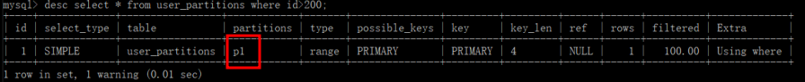

5. type ☆

执行计划的一条记录就代表着MySQL对某个表的执行查询时的访问方法, 又称访问类型, 其中type列就表明了这个访问方法是什么, 是较为重要的一个指标, 比如, 看到type列的值是ref, 表明MySQL即将使用ref访问的方法来执行s1表的查询.

完整的访问方法如下: system , const , eq_ref , ref , fulltext , ref_or_null ,index_merge , unique_subquery , index_subquery , range , index , ALL 。
我们详细解释一下:

- system

```sql
mysql> CREATE TABLE t(i int) Engine=MyISAM;
Query OK, 0 rows affected (0.05 sec)
mysql> INSERT INTO t VALUES(1);
Query OK, 1 row affected (0.01 sec)
```

然后我们看一下查询这个表的执行计划:

```sql
mysql> EXPLAIN SELECT * FROM t;
```

12. 小结

- 不考虑Cache

- 不显示优化过程
- 不会提供触发器, 存储过程或者自定义函数对查询的影响
- 非精确值

## 7. EXPLAIN的进一步使用

### 7.1 EXPLAIN四种输出格式

这里谈谈EXPLAIN的输出格式。EXPLAIN可以输出四种格式: 传统格式 , JSON格式 , TREE格式 以及 可视化输出 。用户可以根据需要选择适用于自己的格式。

1. 传统格式
   传统格式简单明了,输出是一个表格形式,概要说明查询计划。

```sql
mysql> EXPLAIN SELECT s1.key1, s2.key1 FROM s1 LEFT JOIN s2 ON s1.key1 = s2.key1 WHERE
s2.common_field IS NOT NULL;
```

2. JSON格式
   JSON格式:在EXPLAIN单词和真正的查询语句中间加上 FORMAT=JSON

```sql
EXPLAIN FORMAT=JSON SELECT ....
```

我们使用 # 后边跟随注释的形式为大家解释了 EXPLAIN FORMAT=JSON 语句的输出内容,但是大家可能有疑问 "cost_info" 里边的成本看着怪怪的,它们是怎么计算出来的?先看 s1 表的 "cost_info" 部分:

```json
"cost_info": {
"read_cost": "1840.84",
"eval_cost": "193.76",
"prefix_cost": "2034.60",
"data_read_per_join": "1M"
}
```


read_cost 是由下边这两部分组成的:

- IO 成本
- 检测 rows × (1 - filter) 条记录的 CPU 成本

>小贴士: rows和filter都是我们前边介绍执行计划的输出列,在JSON格式的执行计划中,rows
>相当于rows_examined_per_scan,filtered名称不变。

- eval_cost 是这样计算的:检测 rows × filter 条记录的成本。
- prefix_cost 就是单独查询 s1 表的成本,也就是:read_cost + eval_cost
- data_read_per_join 表示在此次查询中需要读取的数据量。

对于 s2 表的 "cost_info" 部分是这样的:

```json
"cost_info": {
"read_cost": "968.80",
"eval_cost": "193.76",
"prefix_cost": "3197.16",
"data_read_per_join": "1M"
}
```

# Chapter 10 索引优化与查询优化

## 1. 准备数据

```sql
#1. 数据准备
CREATE DATABASE atguigudb2;
USE atguigudb2;
#建表
CREATE TABLE `class` (
 `id` INT(11) NOT NULL AUTO_INCREMENT,
 `className` VARCHAR(30) DEFAULT NULL,
 `address` VARCHAR(40) DEFAULT NULL,
 `monitor` INT NULL ,
 PRIMARY KEY (`id`)
) ENGINE=INNODB AUTO_INCREMENT=1 DEFAULT CHARSET=utf8;
 
CREATE TABLE `student` (
 `id` INT(11) NOT NULL AUTO_INCREMENT,
 `stuno` INT NOT NULL ,
 `name` VARCHAR(20) DEFAULT NULL,
 `age` INT(3) DEFAULT NULL,
 `classId` INT(11) DEFAULT NULL,
 PRIMARY KEY (`id`)
 #CONSTRAINT `fk_class_id` FOREIGN KEY (`classId`) REFERENCES `t_class` (`id`)
) ENGINE=INNODB AUTO_INCREMENT=1 DEFAULT CHARSET=utf8;


SET GLOBAL log_bin_trust_function_creators=1; 
```

```sql
 #随机产生字符串
DELIMITER //
CREATE FUNCTION rand_string(n INT) RETURNS VARCHAR(255)
BEGIN    
DECLARE chars_str VARCHAR(100) DEFAULT 'abcdefghijklmnopqrstuvwxyzABCDEFJHIJKLMNOPQRSTUVWXYZ';
DECLARE return_str VARCHAR(255) DEFAULT '';
DECLARE i INT DEFAULT 0;
WHILE i < n DO  
SET return_str =CONCAT(return_str,SUBSTRING(chars_str,FLOOR(1+RAND()*52),1));  
SET i = i + 1;
END WHILE;
RETURN return_str;
END //
DELIMITER ;

#用于随机产生多少到多少的编号
DELIMITER //
CREATE FUNCTION  rand_num (from_num INT ,to_num INT) RETURNS INT(11)
BEGIN   
DECLARE i INT DEFAULT 0;  
SET i = FLOOR(from_num +RAND()*(to_num - from_num+1))   ;
RETURN i;  
END //
DELIMITER ;

#创建往stu表中插入数据的存储过程
DELIMITER //
CREATE PROCEDURE  insert_stu(  START INT ,  max_num INT )
BEGIN  
DECLARE i INT DEFAULT 0;   
 SET autocommit = 0;    #设置手动提交事务
 REPEAT  #循环
 SET i = i + 1;  #赋值
 INSERT INTO student (stuno, NAME ,age ,classId ) VALUES ((START+i),rand_string(6),rand_num(1,50),rand_num(1,1000));  
 UNTIL i = max_num  
 END REPEAT;  
 COMMIT;  #提交事务
END //
DELIMITER ;


#执行存储过程，往class表添加随机数据
DELIMITER //
CREATE PROCEDURE `insert_class`(  max_num INT )
BEGIN  
DECLARE i INT DEFAULT 0;   
 SET autocommit = 0;    
 REPEAT  
 SET i = i + 1;  
 INSERT INTO class ( classname,address,monitor ) VALUES (rand_string(8),rand_string(10),rand_num(1,100000));  
 UNTIL i = max_num  
 END REPEAT;  
 COMMIT; 
END //
DELIMITER ;
```

```sql
#执行存储过程，往class表添加1万条数据  
CALL insert_class(10000);

#执行存储过程，往stu表添加50万条数据  
CALL insert_stu(100000,500000);
```

```sql
# 删除某表上的索引的存储过程
DELIMITER //
CREATE  PROCEDURE `proc_drop_index`(dbname VARCHAR(200),tablename VARCHAR(200))
BEGIN
       DECLARE done INT DEFAULT 0;
       DECLARE ct INT DEFAULT 0;
       DECLARE _index VARCHAR(200) DEFAULT '';
       DECLARE _cur CURSOR FOR  SELECT   index_name   FROM information_schema.STATISTICS   WHERE table_schema=dbname AND table_name=tablename AND seq_in_index=1 AND    index_name <>'PRIMARY'  ;
#每个游标必须使用不同的declare continue handler for not found set done=1来控制游标的结束
       DECLARE  CONTINUE HANDLER FOR NOT FOUND SET done=2 ;      
#若没有数据返回,程序继续,并将变量done设为2
        OPEN _cur;
        FETCH _cur INTO _index;
        WHILE  _index<>'' DO 
               SET @str = CONCAT("drop index " , _index , " on " , tablename ); 
               PREPARE sql_str FROM @str ;
               EXECUTE  sql_str;
               DEALLOCATE PREPARE sql_str;
               SET _index=''; 
               FETCH _cur INTO _index; 
        END WHILE;
   CLOSE _cur;
END //
DELIMITER ;
```

执行存储过程

```sql
CALL proc_drop_index("dbname","tablename");
```

## 2. 索引失效案例

提高性能最有效的方式就是`设计合理的索引`, 索引提供了高效访问数据的方法, 并且加快查询速度. 

- 使用索引可以快速定位表中的某条数据, 从而提高数据的查询速度, 提高数据库性能
- 如果查询时没有使用索引, 查询语句就会扫描表中的所有数据, 在数据量大的情况下, 查询速度会很慢

默认采用B+树来构建索引, 列空间采用R-树, Memroy支持hash索引

优化器基于cost开销(CostBaseoptimizer) 而不是基于Rulebaseoptimizer. SQL是否使用索引,和数据库,数据量,数据选择度都有关系. 

### 2.1 全职匹配

### 2.2 最佳左前缀法则

> 索引文件具有 B-Tree 的最左前缀匹配特性,如果左边的值未确定,那么无法使用此索引。

### 2.3 主键插入顺序

可这个数据页已经满了,再插进来咋办呢?我们需要把当前 页面分裂 成两个页面,把本页中的一些记录移动到新创建的这个页中。页面分裂和记录移位意味着什么?意味着: 性能损耗 !所以如果我们想尽量避免这样无谓的性能损耗,最好让插入的记录的 主键值依次递增 ,这样就不会发生这样的性能损耗了。所以我们建议:让主键具有AUTO_INCREMENT ,让存储引擎自己为表生成主键,而不是我们手动插入 ,比如: person_info 表:

```sql
CREATE TABLE person_info(
id INT UNSIGNED NOT NULL AUTO_INCREMENT,
name VARCHAR(100) NOT NULL,
birthday DATE NOT NULL,
phone_number CHAR(11) NOT NULL,
country varchar(100) NOT NULL,
PRIMARY KEY (id),
KEY idx_name_birthday_phone_number (name(10), birthday, phone_number)
);
```

我们自定义的主键列 id 拥有 AUTO_INCREMENT 属性,在插入记录时存储引擎会自动为我们填入自增的主键值。这样的主键占用空间小,顺序写入,减少页分裂。

### 2.4 计算、函数、类型转换(自动或手动)导致索引失效

```sql
EXPLAIN SELECT SQL_NO_CACHE * FROM student WHERE student.name LIKE 'abc%'; # better 
EXPLAIN SELECT SQL_NO_CACHE * FROM student WHERE LEFT(student.name,3) = 'abc'; # function deprecate index
```

```sql
CREATE INDEX idx_sno ON student(stuno);
EXPLAIN SELECT SQL_NO_CACHE id, stuno, NAME FROM student WHERE stuno+1 = 900001; # addition deprecate index 
EXPLAIN SELECT SQL_NO_CACHE id, stuno, NAME FROM student WHERE stuno = 900000;# better
```

```sql
EXPLAIN SELECT id, stuno, name FROM student WHERE SUBSTRING(name, 1,3)='abc';
EXPLAIN SELECT id, stuno, NAME FROM student WHERE NAME LIKE 'abc%'; # better
```

### 2.5 类型转换导致索引失效

```sql
EXPLAIN SELECT SQL_NO_CACHE * FROM student WHERE name=123;
EXPLAIN SELECT SQL_NO_CACHE * FROM student WHERE name='123'; # name is varchar
```

### 2.6 范围条件右边的列索引失效

```sql
ALTER TABLE student DROP INDEX idx_name;
ALTER TABLE student DROP INDEX idx_age;
ALTER TABLE student DROP INDEX idx_age_classid;
EXPLAIN SELECT SQL_NO_CACHE * FROM student
WHERE student.age=30 AND student.classId>20 AND student.name = 'abc' ;
# 范围以后的索引失效

create index idx_age_name_classid on student(age,name,classid);
EXPLAIN SELECT SQL_NO_CACHE * FROM student WHERE student.age=30 AND student.name =
'abc' AND student.classId>20 ; 

```

### 3.  关联查询优化

#### 3.5 小结

- 保证被驱动表的JOIN字段已经创建了索引
- 需要JOIN 的字段，数据类型保持绝对一致。
- LEFT JOIN 时，选择小表作为驱动表， 大表作为被驱动表 。减少外层循环的次数。
- INNER JOIN 时，MySQL会自动将 小结果集的表选为驱动表 。选择相信MySQL优化策略。
- 能够直接多表关联的尽量直接关联，不用子查询。(减少查询的趟数)
- 不建议使用子查询，建议将子查询SQL拆开结合程序多次查询，或使用 JOIN 来代替子查询。
- 衍生表建不了索引

## 4. 子查询优化

MySQL从4.1版本开始支持子查询，使用子查询可以进行SELECT语句的嵌套查询，即一个SELECT查询的结果作为另一个SELECT语句的条件。 子查询可以一次性完成很多逻辑上需要多个步骤才能完成的SQL操作 。

**子查询是 MySQL 的一项重要的功能，可以帮助我们通过一个 SQL 语句实现比较复杂的查询。但是，子查询的执行效率不高。**原因：

① 执行子查询时，MySQL需要为内层查询语句的查询结果 `建立一个临时表` ，然后外层查询语句从临时表中查询记录。查询完毕后，再 撤销这些临时表 。这样会消耗过多的CPU和IO资源，产生大量的慢查询。

② 子查询的结果集存储的临时表，不论是内存临时表还是磁盘临时表都 不会存在索引 ，所以查询性能会受到一定的影响。

③ 对于返回结果集比较大的子查询，其对查询性能的影响也就越大。

**在MySQL中，可以使用连接（JOIN）查询来替代子查询。**连接查询 不需要建立临时表 ，其 速度比子查询 

要快 ，如果查询中使用索引的话，性能就会更好。

```sql
#查询班长的信息, 子查询方式
EXPLAIN SELECT * FROM student stu1
WHERE stu1.`stuno` IN (
SELECT monitor
FROM class c
WHERE monitor IS NOT NULL
);
# 推荐:多表查询
EXPLAIN SELECT stu1.* FROM student stu1 JOIN class c 
ON stu1.`stuno` = c.`monitor`
WHERE c.`monitor` IS NOT NULL;

# 有改善 不明显
```

```sql
#查询不为班长的学生信息, 子查询方式
EXPLAIN SELECT SQL_NO_CACHE a.* 
FROM student a 
WHERE  a.stuno  NOT  IN (
			SELECT monitor FROM class b 
			WHERE monitor IS NOT NULL);

# 推荐, 多表查询
EXPLAIN SELECT SQL_NO_CACHE a.*
FROM  student a LEFT OUTER JOIN class b 
ON a.stuno =b.monitor
WHERE b.monitor IS NULL;
			
```

> 结论：尽量不要使用NOT IN 或者 NOT EXISTS，用LEFT JOIN xxx ON xx WHERE xx IS NULL替代

## 5. 排序优化

### 5.1 排序优化

在MySQL 中, 支持两种排序方式, 部分鄙视FileSort和Index

- index排序, 索引可以保证数据有序, 不需要在进行排序, 效率更高
- FileSort一般在内存中进行, 占用cpu多, 如果待排结果比较大, 会产生零食文建I/O到磁盘进行排序, 效率较低

**优化建议：**

1. SQL 中，可以在 WHERE 子句和 ORDER BY 子句中使用索引，目的是在 WHERE 子句中 `避免全表扫描` ，在 ORDER BY 子句 `避免使用 FileSort 排序` 。当然，某些情况下全表扫描，或者 FileSort 排序不一定比索引慢。但总的来说，我们还是要避免，以提高查询效率。

2. 尽量使用 Index 完成 ORDER BY 排序。如果 WHERE 和 ORDER BY 后面是相同的列就使用单索引列；如果不同就使用联合索引。

3. 无法使用 Index 时，需要对 FileSort 方式进行调优。

### 5.2 测试

```sql
#删除student和class表中的非主键索引
CALL proc_drop_index('atguigudb2','student');
CALL proc_drop_index('atguigudb2','class');

#过程一：
EXPLAIN SELECT SQL_NO_CACHE * FROM student ORDER BY age,classid; 
EXPLAIN SELECT SQL_NO_CACHE * FROM student ORDER BY age,classid LIMIT 10; 
## filesort

#过程二：order by时不limit，索引失效
#创建索引  
CREATE  INDEX idx_age_classid_name ON student (age,classid,NAME);
#未使用索引， 未限制字段，回表会使用更多时间，放弃使用索引
EXPLAIN  SELECT SQL_NO_CACHE * FROM student ORDER BY age,classid; 
# 不需要回表，使用索引
EXPLAIN  SELECT SQL_NO_CACHE age,classid,name,id FROM student ORDER BY age,classid; 

#limit使用索引， 有限回表数量可接受。
EXPLAIN  SELECT SQL_NO_CACHE * FROM student ORDER BY age,classid LIMIT 10;  
```

练习

```sql
#创建索引age,classid,stuno
CREATE  INDEX idx_age_classid_stuno ON student (age,classid,stuno);
CREATE  INDEX idx_age_classid_name ON student (age,classid,NAME); 
#以下哪些索引失效?
EXPLAIN  SELECT * FROM student ORDER BY classid LIMIT 10; #失效
EXPLAIN  SELECT * FROM student ORDER BY classid,NAME LIMIT 10; #失效  
EXPLAIN  SELECT * FROM student ORDER BY age,classid,stuno LIMIT 10; #有效 
EXPLAIN  SELECT * FROM student ORDER BY age,classid LIMIT 10;#有效
EXPLAIN  SELECT * FROM student ORDER BY age LIMIT 10;# 有效
#过程四：order by时规则不一致, 索引失效 （顺序错，不索引；方向反，不索引）
EXPLAIN  SELECT * FROM student ORDER BY age DESC, classid ASC LIMIT 10; #失效
EXPLAIN  SELECT * FROM student ORDER BY classid DESC, NAME DESC LIMIT 10;#失效
EXPLAIN  SELECT * FROM student ORDER BY age ASC,classid DESC LIMIT 10; #失效
#全部反向backward index scan
EXPLAIN  SELECT * FROM student ORDER BY age DESC, classid DESC LIMIT 10;#有效
#过程五：无过滤，不索引
#where查找结果数量不大， 有可能不使用联合索引，仅使用age，查询后直接回表。
EXPLAIN  SELECT * FROM student WHERE age=45 ORDER BY classid; #有效
EXPLAIN  SELECT * FROM student WHERE  age=45 ORDER BY classid,NAME; #有效
#未使用最左侧
EXPLAIN  SELECT * FROM student WHERE  classid=45 ORDER BY age; #失效
#先排序， idx_age_classid_name
EXPLAIN  SELECT * FROM student WHERE  classid=45 ORDER BY age LIMIT 10;#有效
CREATE INDEX idx_cid ON student(classid);
# 有索引的时候使用索引， 检索where字段，using filesort
EXPLAIN  SELECT * FROM student WHERE  classid=45 ORDER BY age;
```

小结：

```sql
INDEX a_b_c(a,b,c) order by 能使用索引最左前缀
- ORDER BY a
- ORDER BY a,b
- ORDER BY a,b,c
- ORDER BY a DESC,b DESC,c DESC 如果WHERE使用索引的最左前缀定义为常量，则order by 能使用索引
- WHERE a = const ORDER BY b,c
- WHERE a = const AND b = const ORDER BY c
- WHERE a = const ORDER BY b,c
- WHERE a = const AND b > const ORDER BY b,c 不能使用索引进行排序
- ORDER BY a ASC,b DESC,c DESC /* 排序不一致 */
- WHERE g = const ORDER BY b,c /*丢失a索引*/
- WHERE a = const ORDER BY c /*丢失b索引*/
- WHERE a = const ORDER BY a,d /*d不是索引的一部分*/
- WHERE a in (...) ORDER BY b,c /*对于排序来说，多个相等条件也是范围查询*/
```

### 5.3 案例实战

```sql
#实战：测试filesort和index排序
CALL proc_drop_index('atguigudb2','student');
# type:all filesort
EXPLAIN SELECT SQL_NO_CACHE * FROM student WHERE age = 30 AND stuno <101000 ORDER BY NAME ;

#方案一: 为了去掉filesort我们可以把索引建成
CREATE INDEX idx_age_name ON student(age,NAME);
# type:ref len:5, 仅使用age索引
EXPLAIN SELECT SQL_NO_CACHE * FROM student WHERE age = 30 AND stuno <101000 ORDER BY NAME ;

#方案二：
CREATE INDEX idx_age_stuno_name ON student(age,stuno,NAME);
# type:range len:9 filesort， 使用age，stuno两项索引，结果已经很小，filesort损失有限。
EXPLAIN SELECT SQL_NO_CACHE * FROM student WHERE age = 30 AND stuno <101000 ORDER BY NAME ;

```

>结论：
>
>1. 两个索引同时存在，mysql自动选择最优的方案。（对于这个例子，mysql选择idx_age_stuno_name）。但是， 随着数据量的变化，选择的索引也会随之变化的 。 
>
>2. **当【范围条件】和【group by 或者 order by】的字段出现二选一时，优先观察条件字段的过滤数量，如果过滤的数据足够多，而需要排序的数据并不多时，优先把索引放在范围字段上。反之，亦然。**

### 5.4 filesort算法：双路排序和单路排序

**双路排序 （慢）**

- `MySQL 4.1之前是使用双路排序 `，字面意思就是两次扫描磁盘，最终得到数据， 读取行指针和`order by列` ，对他们进行排序，然后扫描已经排序好的列表，按照列表中的值重新从列表中读取对应的数据输出

- 从磁盘取排序字段，在buffer进行排序，`再从 磁盘取其他字段 `。

取一批数据，要对磁盘进行两次扫描，众所周知，IO是很耗时的，所以在mysql4.1之后，出现了第二种改进的算法，就是单路排序。

**单路排序 （快）**

从磁盘读取查询需要的 所有列 ，按照order by列在buffer对它们进行排序，然后扫描排序后的列表进行输出， 它的效率更快一些，避免了第二次读取数据。并且把随机IO变成了顺序IO，但是它会使用更多的空间， 因为它把每一行都保存在内存中了。

**结论及引申出的问题**

- 由于单路是后出的，总体而言好过双路
- 但是用单路有问题
  - 在sort_buffer中，单路比多路要占用很多空间， 因为单路是把所有字段都取出，有可能去除的数据的总数超出了sort_buffer的容量， 导致每次只能取sort_buffer容量大小的数据，并进行排列（创建tmp文件，多路合并），排完再取sort_buffer容量大小的数据排序，直至完成。需要多次IO
  - 单路本来想节省I/O操作，反而得不偿失。

**优化策略**

1. **尝试提高 sort_buffer_size **

   默认1M

   ```sql
   SHOW VARIABLES LIKE ‘%sort_buffer_size%';
   +-------------------------+---------+
   | Variable_name           | Value   |
   +-------------------------+---------+
   | innodb_sort_buffer_size | 1048576 |
   | myisam_sort_buffer_size | 8388608 |
   | sort_buffer_size        | 262144  |
   +-------------------------+---------+
   3 rows in set (0.00 sec)
   ```

2. **尝试提高 max_length_for_sort_data** 

   - 提高这个参数，会增加用改进算法的概率。

     ```sql
     SHOW VARIABLES LIKE ‘%max_length_for_sort_data%';
     ```

   - 如果设的太高， 数据总容量超出sort_buffer_size的概率就增大， 明显症状就是高磁盘I/O和低处理器使用率。如果需要返回的列的总长度大于max_length_for_sort_data，使用双路算法， 否则使用单路算法，1024-8192字节之间调整。

     

3. **Order by 时select  * 是一个大忌。最好只Query需要的字段。**

- 当Query的字段大小总和小于max_length_for_sort_data，而且排序字段不是TEXT|BLOB时，会用改进后的算法——单路排序，否则用老算法——多路排序
- 两种算法的数据都有可能超出sort_buffer_size的容量，超出之后，会创建tmp文件进行合并排序，导致多次I/O，但是用单路排序算法的风险会更大一些，所以要提高sort_buffer_size。

## 6. GROUP BY**优化**

- group by 使用索引的原则几乎跟order by一致 ，group by 即使没有过滤条件用到索引，也可以直接使用索引。

- group by 先排序再分组，遵照索引建的最佳左前缀法则

- 当无法使用索引列，增大 `max_length_for_sort_data` 和 `sort_buffer_size` 参数的设置

- where效率高于having，能写在where限定的条件就不要写在having中了

- **减少使用order by，和业务沟通能不排序就不排序，或将排序放到程序端去做**。Order by、group by、distinct这些语句较为耗费CPU，数据库的CPU资源是极其宝贵的。

- 包含了order by、group by、distinct这些查询的语句，where条件过滤出来的结果集请保持在1000行以内，否则SQL会很慢。

## 7. **优化分页查询**

一般分页查询时，通过创建覆盖索引能够比较好的提升性能。一个常见又非常头疼的问题就是limit 200000,10，此时需要MySQL排序前200010行记录， 仅返回200000-200010的记录，其他记录丢弃，查询排序的代价非常大。

优化思路1

在索引上完成排序分页操作，最后根据主键关联回原表查询所需要的其他列内容。

```sql
EXPLAIN SELECT * FROM student t,(SELECT id FROM student ORDER BY id LIMIT 2000000,10) aWHERE t.id = a.id;
```

优化思路2

该方案适用于主键自增的表，可以把Limit 查询转换成某个位置的查询 。 

```sql
#主键自增
EXPLAIN SELECT * FROM student WHERE id > 2000000 LIMIT 10;
```

## 8. 优先考虑覆盖索

#### 8.1 **什么是覆盖索引？**

**理解方式一**：索引是高效找到行的一个方法，但是一般数据库也能使用索引找到一个列的数据，因此它不必读取整个行。毕竟索引叶子节点存储了它们索引的数据；当能通过读取索引就可以得到想要的数据，那就不需要读取行了。**一个索引包含了满足查询结果的数据就叫做覆盖索引。**

**理解方式二**：非聚簇复合索引的一种形式，它包括在查询里的SELECT、JOIN和WHERE子句用到的所有列（即建索引的字段正好是覆盖查询条件中所涉及的字段）。

简单说就是， 索引列+主键 包含 SELECT 到 FROM之间查询的列 。 

```sql
#删除之前的索引
#举例1：
DROP INDEX idx_age_stuno ON student;
CREATE INDEX idx_age_name ON student (age,NAME);
# 因需要回表，综合成本高，未使用索引
EXPLAIN SELECT * FROM student WHERE age <> 20;
# 使用索引，覆盖索引,省去回表
EXPLAIN SELECT age,NAME FROM student WHERE age <> 20;
#举例2：
# 因需要回表，综合成本高，未使用索引
EXPLAIN SELECT * FROM student WHERE NAME LIKE '%abc';
# 使用索引，覆盖索引,省去回表
EXPLAIN SELECT id,age FROM student WHERE NAME LIKE '%abc';
```


#### 8.2 覆盖索引的利弊

**好处：**

1. **避免Innodb表进行索引的二次查询（回表）**

   在二级索引中获得所要的数据，避免对主键的二次查询，减少了IO操作

2. **可以把随机IO变成顺序IO加快查询效率**

   覆盖索引按键值顺序存储，对于IO密集型的范围查找来说，将随机读取IO变为顺序IO

**由于覆盖索引可以减少数的搜索次数，显著提升查询性能，所以覆盖索引是一个常用的性能优化手段。**

**弊端：**

`索引字段的维护` 总是有代价的。因此，在建立冗余索引来支持覆盖索引时就需要权衡考虑了。这是业务DBA，或者称为业务数据架构师的工作。

## 9. **如何给字符串添加索引**

有一张教师表，表定义如下：

```sql
create table teacher( ID bigint unsigned primary key, email varchar(64), ... )engine=innodb;
```

